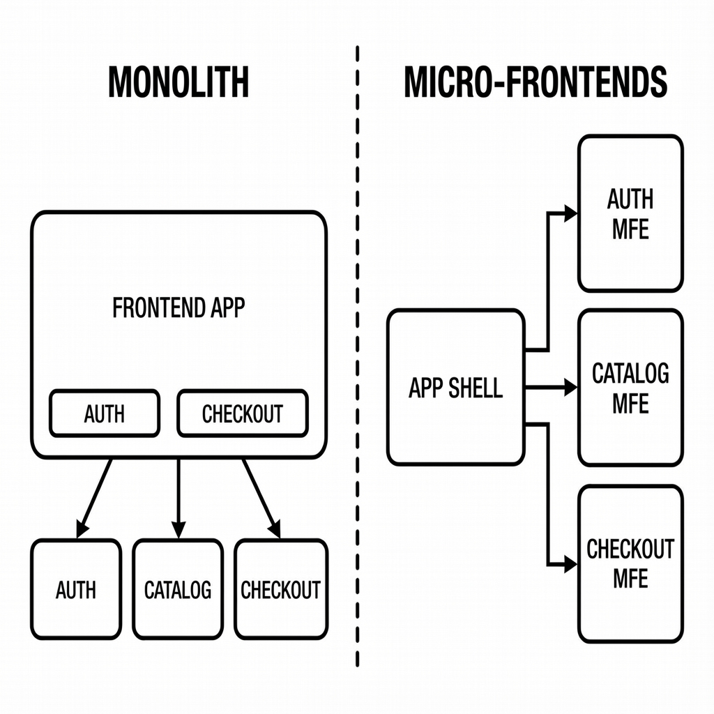
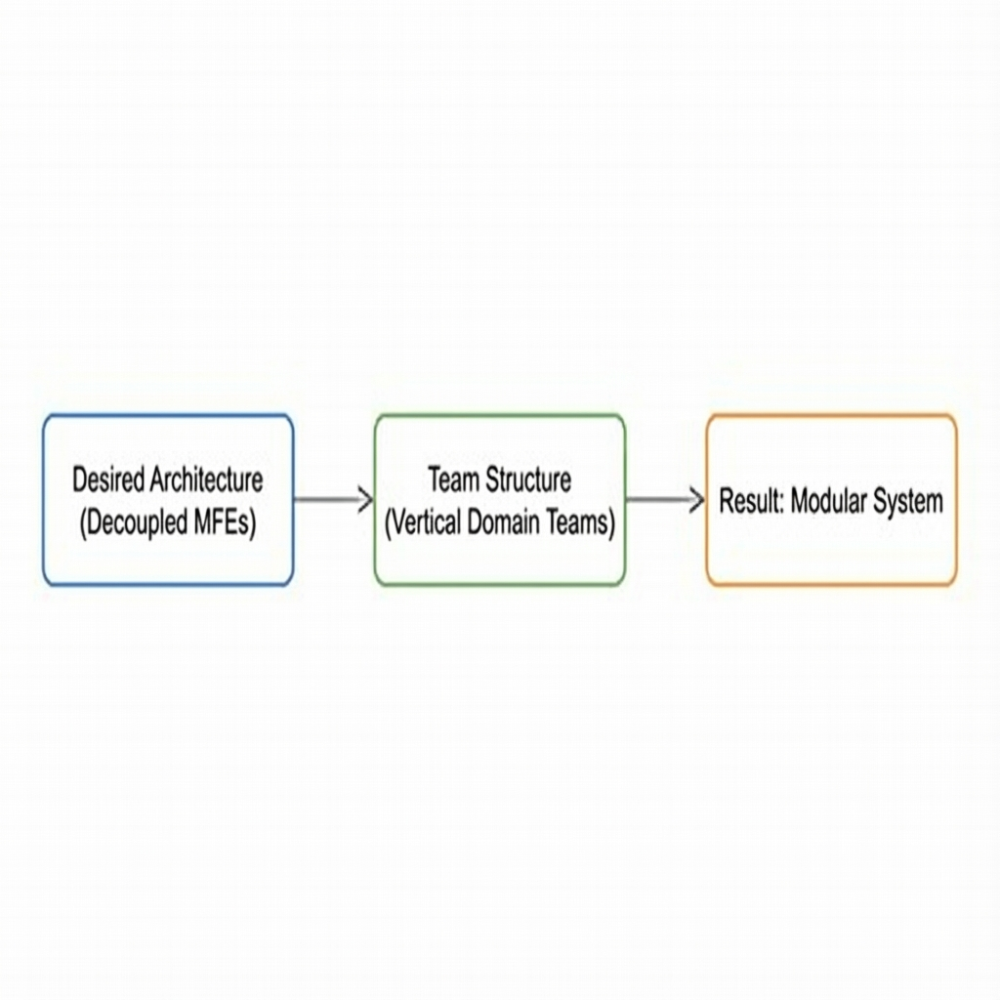
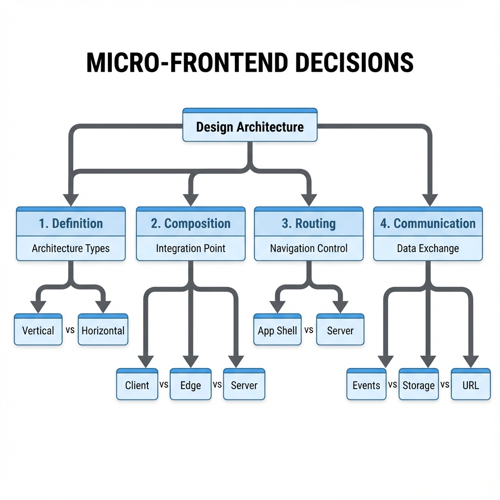
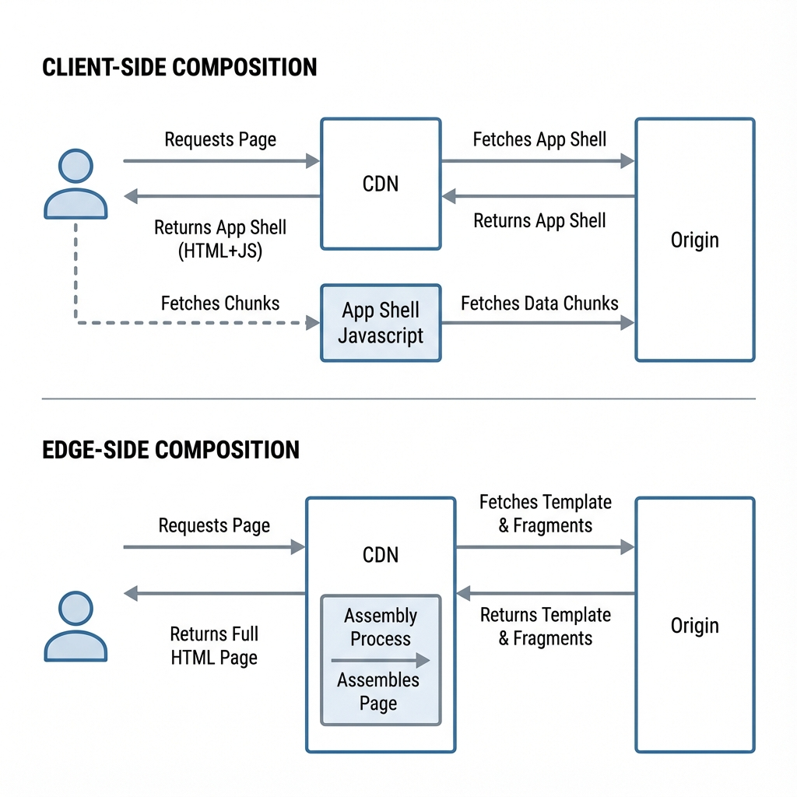
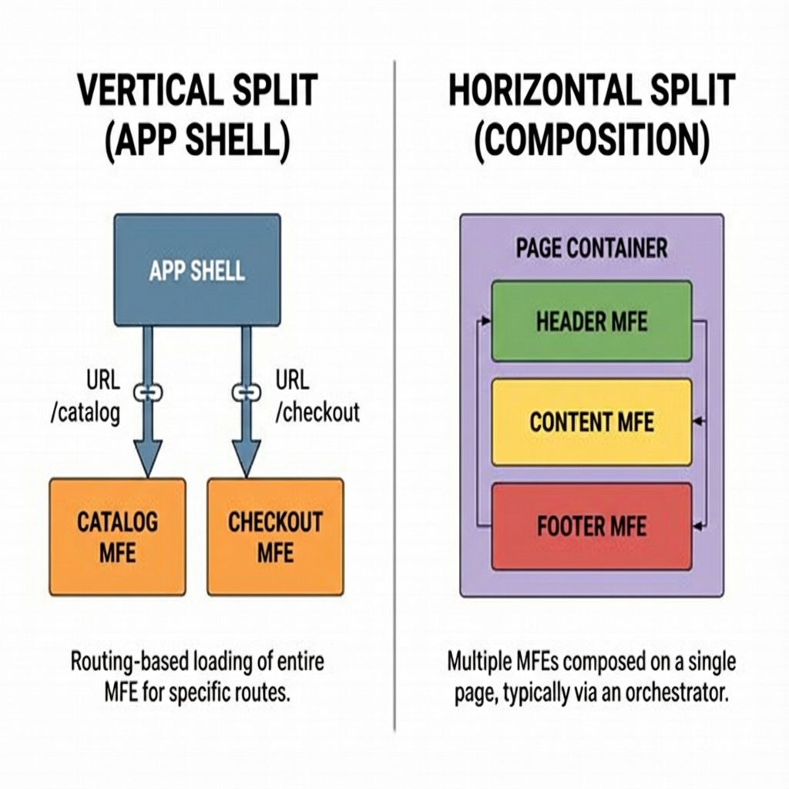
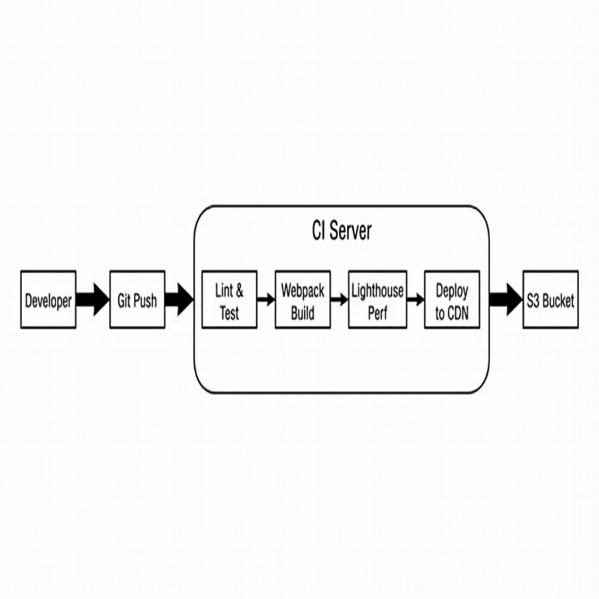
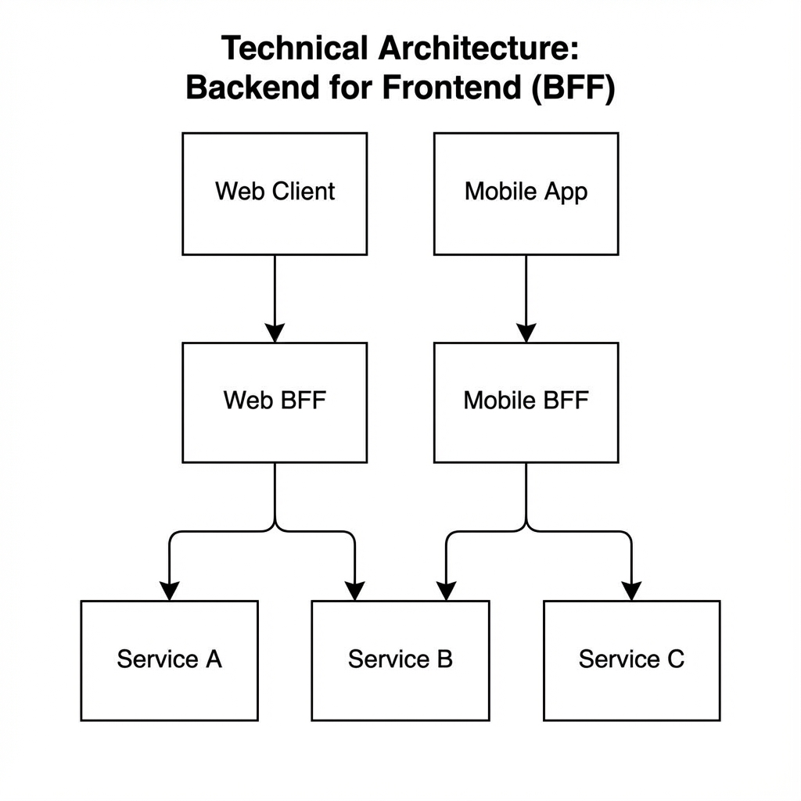

# Synopsis: Building Micro-frontends
- Author: Luca Mezzalira
- Year: 2021
- Publisher: O'Reilly Media
- Summary By: Antigravity

---

## Preface

The author, Luca Mezzalira, shares his extensive experience at DAZN, where he was responsible for architecting a frontend platform served to millions of users across more than 30 different devices, including Smart TVs, Consoles, and the Web. The primary driver for adopting [Micro-frontends](#micro-frontends) was the need for organizational scalability. In a Hyper-Growth startup environment, having hundreds of developers working on a single monolithic codebase became a significant bottleneck.

The core goal of this architecture is to bring the well-known benefits of Microservices—such as independent deployment, decoupled codebases, and team autonomy—to the Frontend layer. This allows multiple teams to work in parallel on the same product without stepping on each other's toes or being blocked by a shared release pipeline.

---

## Chapter 1: The Frontend Landscape

This chapter explores the historical context of frontend development and identifies the specific problems that [Micro-frontends](#micro-frontends) aim to solve.

### The Frontend Monolith Problem

As Single Page Applications ([SPAs](#spa)) evolved, they naturally grew in complexity. What started as small JavaScript applications became massive repositories containing hundreds of thousands of lines of code. This growth led to several critical issues that mirror backend monoliths.
- Continuous Integration and Deployment (CI/CD) pipelines became agonizingly slow. A simple one-line CSS change could require rebuilding, linting, and testing the entire application, taking up to 45 minutes or more.
- The cognitive load for new developers increased dramatically. To make a meaningful contribution, a developer often needed to understand the entire codebase, which becomes impossible at scale.
- Dependency management became a nightmare, often referred to as "Dependency Hell." Upgrading a core framework like React or Angular meant upgrading the entire application at once. This all-or-nothing approach often froze feature development for weeks while teams coordinated the upgrade.

### Architecture Comparison



- [SPA](#spa) (Single Page Application): The user downloads a single large JavaScript bundle. This provides a fast, native-like navigation experience once loaded, but as the app grows, the initial load time suffers, and the codebase becomes a "Distributed [Monolith](#monolith)".
- [Isomorphic](#isomorphic)/[SSR](#ssr): The code runs on both the server and the client. This improves Search Engine Optimization (SEO) and First Contentful Paint (FCP) but significantly increases infrastructure complexity and operational overhead.
- [Jamstack](#jamstack): This architecture focuses on pre-rendering static files served via a CDN. It is extremely secure and fast but can be difficult to scale for highly dynamic or personalized content where pages cannot be built ahead of time.
- [Micro-frontends](#micro-frontends): This approach breaks the [Monolith](#monolith) into vertical slices organized around business domains. It applies the same principles of isolation and autonomy found in microservices to the frontend.

> [!NOTE]
> [Micro-frontends](#micro-frontends) are not a universal solution for every problem. They introduce a specific trade-off: they reduce Code Complexity (making individual repositories smaller and easier to understand) but increase Operational Complexity (requiring sophisticated tooling to orchestrate, deploy, and monitor multiple applications).

---

## Chapter 2: Micro-Frontend Principles

This chapter outlines the fundamental principles that guide a successful adoption of [Micro-frontends](#micro-frontends).

### Conway's Law and The Inverse Conway Maneuver

[Conway's Law](#conways-law) states that organizations are constrained to produce designs that are copies of the communication structures of these organizations. If an organization creates one giant frontend team, the result will inevitably be a monolithic frontend application. If teams are siloed by technology (e.g., a Database team, a Backend team, a Frontend team), the resulting architecture will be layered rather than feature-focused.

The solution to this is the [Inverse Conway Maneuver](#inverse-conway-maneuver). This strategic approach dictates that you should design the architecture you want first, and then restructure your teams to match it. If you want a decoupled system, you must create decoupled teams that are cross-functional and own a specific vertical slice of the product.



### Core Principles

- Model Around Business Domains. Do not slice your [Micro-frontends](#micro-frontends) based on technical layers. Avoid creating a "Footer Team" or a "Header Team." Instead, align them with [Domain-Driven Design (DDD)](#domain-driven-design) concepts. A "Checkout Team" or a "Discovery Team" focuses on a specific business capability and owns that stack end-to-end.
- Culture of Automation. You cannot manage 50 separate repositories manually. Automation is not optional; it is a requirement. CI/CD pipelines must be 100% automated to handle the increased operational load.
- Hide Implementation Details. APIs between [Micro-frontends](#micro-frontends) should be explicit and minimal. Internal implementation details, such as the specific state management library or utility functions used within a micro-frontend, should be hidden from other parts of the system to prevent tight coupling.
- Decentralize Decisions. Empower teams to own their technology stack. If Team A needs to use React 16 while Team B wants to upgrade to React 17 for a new feature, the architecture should support this. However, this freedom should be used with caution to avoid performance degradation.
- Independent Deployment. This is the "Golden Rule" of [Micro-frontends](#micro-frontends). A change in the "Catalog" micro-frontend should never require a redeployment of the "Checkout" micro-frontend. If you have to coordinate deployments, you have built a distributed monolith, not [Micro-frontends](#micro-frontends).

---

## Chapter 3: Micro-Frontend Architectures and Challenges

Designing a [Micro-frontend](#micro-frontends) architecture is not a one-size-fits-all process. It requires navigating a "Decisions Framework" to choose the right approach for your context.

### The Decisions Framework

Before writing any code, architects must make four key decisions that will define the shape of the system.



### 1. Definition (The Split)
This decision defines how the application is broken down into smaller pieces.
- [Vertical Split](#vertical-split): Each micro-frontend takes ownership of a full page or a group of pages. For example, when a user navigates to `/catalog`, the "Catalog App" loads. When they navigate to `/checkout`, the "Checkout App" loads. This is often the simplest place to start because it respects distinct user flows and keeps complexity low.
- [Horizontal Split](#horizontal-split): Multiple micro-frontends coexist on the same page at the same time. For example, a single page might contain a "Header MFE," a "Footer MFE," and a "Recommendation MFE." This is powerful for highly reusable components but creates significant orchestration challenges.

### 2. Composition (The Stitching)
Composition refers to how the final view is assembled from the various micro-frontends.



- Client-Side Composition. This uses an [App Shell](#app-shell) running in the browser to load and mount fragments. It is excellent for rich interactivity and [SPA](#spa)-like experiences. Popular tools include [Module Federation](#module-federation), Single-spa, and Tailor.js.
- Edge-Side Composition ([ESI](#esi)). The Content Delivery Network (CDN) assembles the HTML page from tags like `<esi:include src="...">`. This is extremely fast because it happens close to the user and is highly cacheable. However, it offers a poor Developer Experience (DX) because it is difficult to replicate the CDN environment locally for testing.
- Server-Side Composition ([SSI](#ssi)). The origin server (or a proxy like NGINX) assembles the page before sending it to the client. This is the best option for SEO because the crawler receives a fully rendered page.

### 3. Communication
Since [Micro-frontends](#micro-frontends) are distributed, they need a way to communicate without becoming tightly coupled.
- Events. Using the browser's `window` object or a Pub/Sub event bus is the most decoupled approach. One micro-frontend emits an event, and others listen for it without knowing who sent it.
- Web Storage. Cookies and LocalStorage are useful for persisting global state like Authentication Tokens or user preferences that need to survive a page reload.
- Query Strings. URL parameters are excellent for passing volatile state, such as `?productId=123`, allowing for deep linking.

### Code Example: Custom Event Bus
Ideally, you should avoid importing heavy shared libraries for communication. Native CustomEvents are powerful enough for most use cases.

```javascript
// Publisher (e.g., Catalog MFE)
const itemSelected = new CustomEvent('mfe:item-selected', {
    detail: { id: '123', price: 99.99 }
});
window.dispatchEvent(itemSelected);

// Subscriber (e.g., Cart MFE)
window.addEventListener('mfe:item-selected', (event) => {
    const { id, price } = event.detail;
    addToCart(id, price);
});
```

> [!WARNING]
> Do not share a global state management store (like a Redux store) between [Micro-frontends](#micro-frontends). Doing so creates a high degree of coupling, effectively recreating the monolith you tried to escape. Share events, not state.

---

## Chapter 4: Discovering Micro-Frontend Architectures

This chapter provides a detailed breakdown of the specific implementation architectures available. It moves beyond high-level patterns to specific technical approaches.

### The Vertical Split vs Horizontal Split

One of the first practical decisions is how to divide the user interface.



### Key Architectures

- Application Shell ([Vertical Split](#vertical-split)). In this architecture, often referred to as the "SPA approach," a single team owns the implementation of an entire page or view. An orchestrator, known as the [App Shell](#app-shell), loads the appropriate application based on the URL. This method keeps domain boundaries very clear. For instance, the "Checkout" team owns everything on the checkout page. It is the easiest migration path for teams used to building SPAs.
- Web Components ([Horizontal Split](#horizontal-split)). This approach uses standard browser APIs to create Custom Elements (e.g., `<my-header></my-header>`). These components encapsulate their own logic and styling, making them framework-agnostic. However, they can be difficult to use with Server-Side Rendering ([SSR](#ssr)), which impacts SEO.
- [Module Federation](#module-federation). Introduced in Webpack 5, this is widely considered the industry standard for modern [Micro-frontends](#micro-frontends). It allows a JavaScript application to dynamically import code from another application at runtime. It solves the performance "double-loading" problem by allowing applications to share common dependencies like React or Lodash if the versions match.

### Code Example: Webpack Module Federation
In [Module Federation](#module-federation) terms, the `Host` is the container that consumes code, and the `Remote` is the provider that exposes code.

```javascript
// HOST: webpack.config.js
new ModuleFederationPlugin({
    name: "AppShell",
    remotes: {
        Catalog: "Catalog@http://localhost:3002/remoteEntry.js",
        Auth: "Auth@http://localhost:3003/remoteEntry.js",
    },
    // Shared dependencies prevent downloading React twice
    shared: { react: { singleton: true }, "react-dom": { singleton: true } }
});

// USAGE in React
const CatalogMFE = React.lazy(() => import("Catalog/App"));
```

---

## Chapter 5: Technical Implementation Strategy

This chapter walks through the practical aspects of setting up a [Micro-frontend](#micro-frontends) project, specifically addressing the "Swag Store" case study built with React and Webpack.

### Project Structure (Polyrepo)

The author recommends a Polyrepo approach, where each [Micro-frontend](#micro-frontends) lives in its own repository. This enforces strict decoupling and ensuring that each project has its own independent CI/CD pipeline.
```text
/auth-mfe
  /src
  /webpack.config.js
  /pipeline.yaml
/catalog-mfe
  /src
  /webpack.config.js
/app-shell
  /src (Orchestration Logic)
```

### CSS Isolation strategies

One of the hardest problems in a [Horizontal Split](#horizontal-split) is "CSS bleeding," where styles from one micro-frontend accidentally affect another (e.g., a global `h1 { color: red }` rule). There are several strategies to handle this.
- BEM (Block Element Modifier). This methodology relies on manual discipline. Developers agree to prefix all classes with their domain name, such as `.mfe-catalog__button`. While simple, it is prone to human error.
- CSS Modules or CSS-in-JS. This is the recommended approach for modern applications. Tools like Webpack or libraries like Styled Components automatically generate unique, hashed class names (e.g., `.Button_abc123`) at build time. This guarantees that styles are locally scoped and cannot conflict with other parts of the application.
- Shadow DOM. This uses the browser's native encapsulation mechanism to strictly isolate styles. While effective, it can make it difficult to share global styles from a Design System, as the shadow boundary blocks all external CSS.

### Code: CSS Modules (React)

```javascript
// Button.module.css
.btn { background: blue; }

// Button.js
import styles from './Button.module.css';
<button className={styles.btn}>Click Me</button>
// Renders as <button class="Button_btn_x9z2"> -> Unique!
```

---

## Chapter 6: Build and Deploy

Automation is a critical pillar of [Micro-frontends](#micro-frontends). Without robust pipelines, the overhead of managing dozens of repositories will overwhelm the team.

### The CI/CD Pipeline

A robust pipeline should remove manual intervention entirely. Every commit should trigger a series of automated checks.



- Lint & Unit Test. The first gate checks code quality and runs fast unit tests.
- Build. This step compiles the assets (e.g., Webpack build).
- Performance Budget. Tools like Lighthouse can be run in the pipeline to fail the build if the bundle size exceeds a certain limit (e.g., 100KB), ensuring performance doesn't degrade over time.
- Deploy to CDN. Finally, the static assets are uploaded to a content delivery network.

### Deployment Strategies

Decoupled architectures allow for safer deployment strategies that are risky or impossible in a monolith.
- Blue/Green Deployment. You deploy the new version ("Green") alongside the old version ("Blue"). Once the new version is healthy, you switch the router to send 100% of traffic to Green. If an issue is found, you can instantly switch back to Blue.
- Canary Releases. This is a more gradual approach. You roll out the new version to a small subset of users (e.g., 10%) or a specific market. You monitor error rates and performance metrics. If everything looks good, you gradually increase traffic to 100%. This limits the "Blast Radius" of a bad bug to a small number of users.

---

## Chapter 8: Backend Patterns

[Micro-frontends](#micro-frontends) do not exist in a vacuum; they must communicate with backend services. A naive approach of having every micro-frontend call general-purpose microservices directly often leads to "chattiness" and performance issues.

### Backend for Frontend (BFF)

The [BFF](#bff) pattern introduces a dedicated API layer specifically for the frontend experience.



- Dedicated API. Instead of a generic "User API" that returns 50 fields, a "Mobile BFF" might expose a lightweight endpoint returning only the 5 fields needed for the mobile screen, while a "Web BFF" returns more data for the desktop view.
- Ownership. Unlike traditional shared APIs owned by backend teams, the [BFF](#bff) is typically owned and maintained by the **Frontend Team**. This allows the frontend developers to iterate quickly on their data requirements without waiting for backend changes.

### Service Dictionary

Hardcoding API URLs (e.g., `https://api.catalog.com`) inside frontend code is brittle. If the endpoint changes, you have to redeploy the frontend.
- A **Service Dictionary** is a JSON file loaded at runtime (e.g., during the [App Shell](#app-shell) initialization). It maps logical names (like `catalog_service`) to actual URLs. This allows operations teams to retarget traffic or migrate backends without touching the frontend code.

---

## Chapter 9: Migration Strategies

Migrating from a [Monolith](#monolith) to [Micro-frontends](#micro-frontends) is a journey, not a switch. The "Strangler Pattern" is the most effective strategy for this transition.

### The Strangler Pattern

This pattern involves incrementally replacing functionality in the legacy system with new components until the legacy system is no longer needed (strangled).

- Intercept. Place a proxy or routing layer (like NGINX or AWS Lambda@Edge) in front of your legacy application.
- Route. Identify a specific vertical slice to migrate first, such as the "Catalog" page. Configure the router to send requests for `/catalog` to the new [Micro-frontend](#micro-frontends), while sending everything else (`/`, `/account`, `/checkout`) to the legacy monolith.
- Replace. Once the "Catalog" is live and stable, pick the next slice (e.g., "Account") and repeat the process. Over time, the monolith receives less and less traffic until it can be safely decommissioned.

---

## Chapter 10: Organizational Shift

Adopting [Micro-frontends](#micro-frontends) is as much a cultural shift as a technical one.

### Team Topologies

- Stream-aligned teams. These are the "Vertical" teams. They are cross-functional (Frontend, Backend, Product, Design) and own a specific stream of value (e.g., "Checkout Flow"). They are optimized for speed and autonomy.
- Platform teams. These teams build the internal tools that enable the Stream-aligned teams to work effectively. They own the "Paved Road"—the CI/CD pipelines, the [Design System](#design-system), and the [App Shell](#app-shell). Their goal is to reduce the friction for other teams.

### Governance

How do you maintain consistency when teams are autonomous?
- Request for Comments (RFCs). Before making a significant architectural change (like introducing a new library), a developer writes an RFC. This document is circulated for feedback from other teams. It encourages discussion and alignment without requiring a central "Architect" to make all the decisions.
- Architectural Decision Records (ADRs). Once a decision is made (e.g., "We will use React 17"), it is documented in an ADR. This provides a history of *why* decisions were made, helping future team members understand the context.

---

## Glossary

### App Shell
A thin architectural layer, usually a minimal HTML and JavaScript application, that is responsible for the initial load, routing, and orchestration of [Micro-frontends](#micro-frontends). It is the "container" that holds the pieces together.

### BFF
**Backend for Frontend**. An architectural pattern where a dedicated backend service is created for a specific frontend user experience (e.g., Mobile vs. Web) to optimize data fetching.

### Conway's Law
An observation by Melvin Conway that states "organizations which design systems ... are constrained to produce designs which are copies of the communication structures of these organizations."

### Domain-Driven Design
A software design approach focusing on modeling software to match a domain according to input from that domain's experts.

### ESI
**Edge Side Includes**. A markup language used to instruct a Content Delivery Network (CDN) to fetch and include dynamic web content (fragments) at the network edge, assembling the final page before it reaches the user.

### Horizontal Split
A strategy where multiple micro-frontends (e.g., Header, Footer, Content) are composed together on a single page.

### Hydration
The process where Client-side JavaScript attaches event listeners and state to HTML that was rendered on the server (SSR). This makes the static HTML interactive.

### Inverse Conway Maneuver
A strategy of proactively structuring teams and communication paths to encourage the desired software architecture to emerge.

### Isomorphic
JavaScript applications that can run both on the client and the server (often used interchangeably with [SSR](#ssr)).

### Jamstack
An architecture designed to make the web faster, more secure, and easier to scale. It builds on many of the tools and workflows which developers love, and which bring maximum productivity.

### Micro-frontends
An architectural style where independently deliverable frontend applications are composed into a greater whole.

### Module Federation
A feature introduced in Webpack 5 that allows a JavaScript application to dynamically load code from another independent application at runtime, enabling code sharing and micro-frontend composition.

### Monolith
A software application where the user interface and data access code are combined into a single program from a single platform.

### SPA
**Single Page Application**. A web application or website that interacts with the user by dynamically rewriting the current web page with new data from the web server, instead of the default method of the browser loading entire new pages.

### SSR
**Server-Side Rendering**. The technique of rendering a standard HTML page on the server and sending it to the client, rather than rendering it entirely in the browser with JavaScript.

### Strangler Pattern
A migration strategy to gradually replace a legacy system by incrementally building new components around it and routing traffic to them, eventually making the legacy system obsolete.

### Vertical Split
An architectural pattern where a single [Micro-frontend](#micro-frontends) owns an entire page or view, minimizing the need for complex composition logic on the client side.

---

## References

- **Conway's Law:** Referenced in [Chapter 2](#chapter-2-micro-frontend-principles).
- **Inverse Conway Maneuver:** Referenced in [Chapter 2](#chapter-2-micro-frontend-principles).
- **Decisions Framework:** The 4-pillar methodology is the core subject of [Chapter 3](#chapter-3-micro-frontend-architectures-and-challenges).
- **Module Federation:** Detailed technical specifications found in [Chapter 4](#chapter-4-discovering-micro-frontend-architectures) and [Chapter 5](#chapter-5-technical-implementation-strategy).
- **Strangler Pattern:** The primary migration strategy discussed in [Chapter 9](#chapter-9-migration-strategies).

