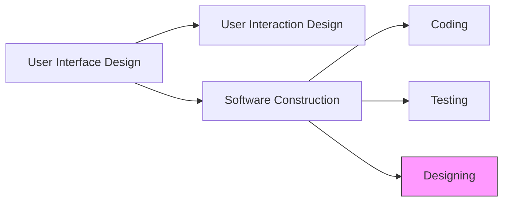
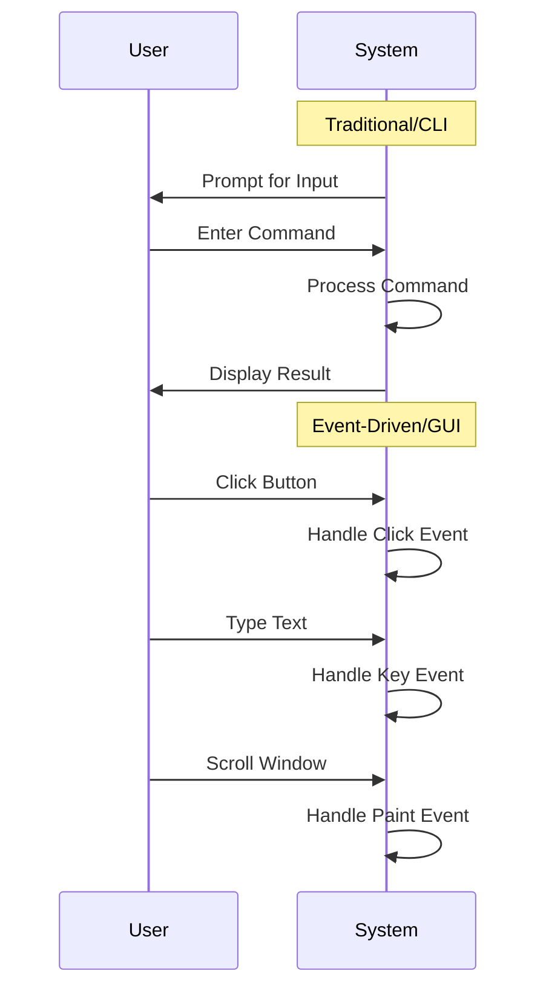
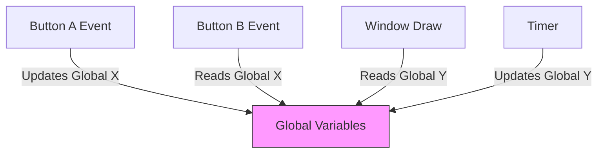
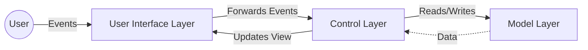
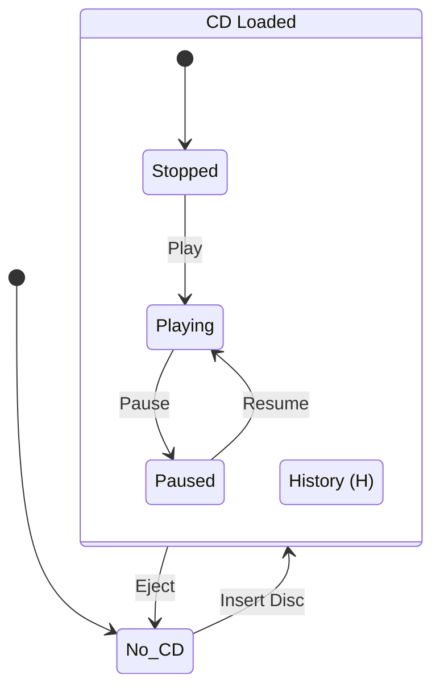
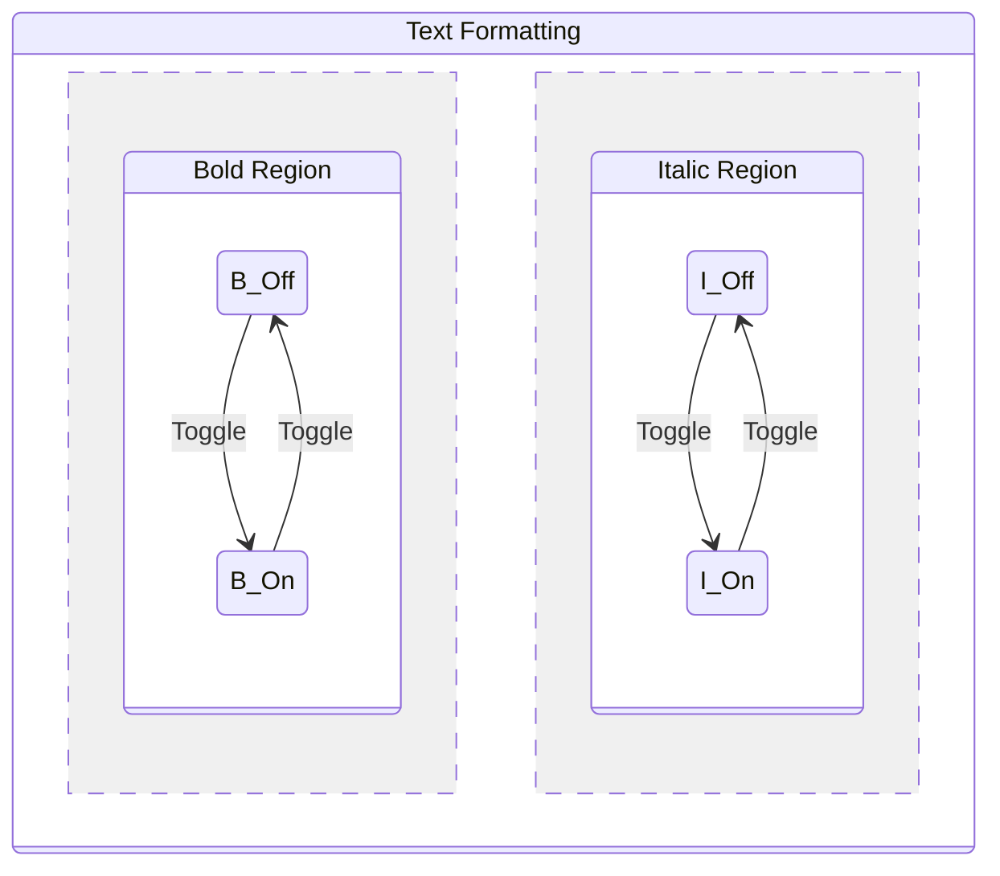
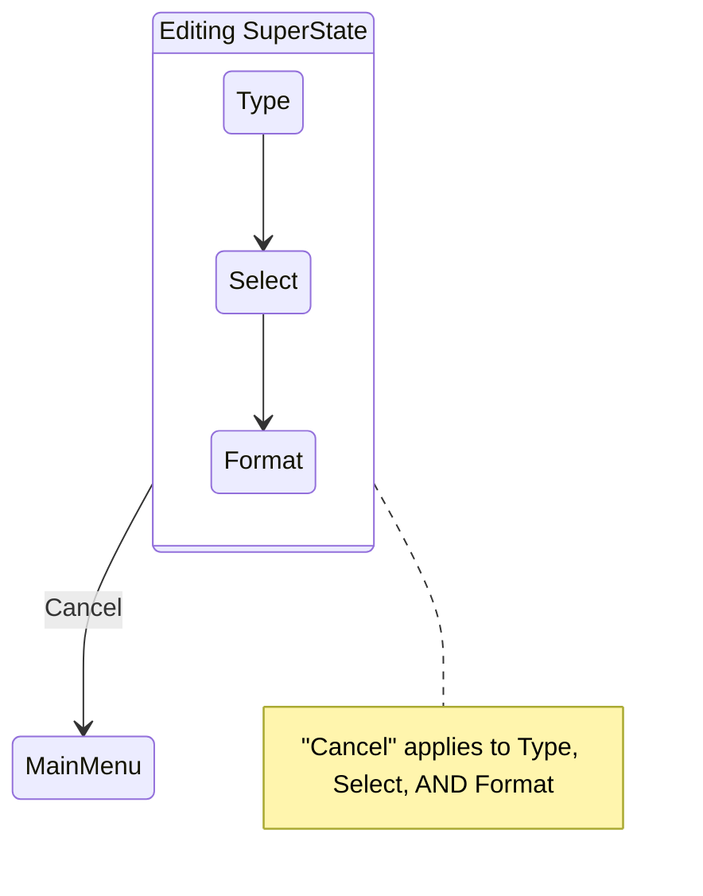
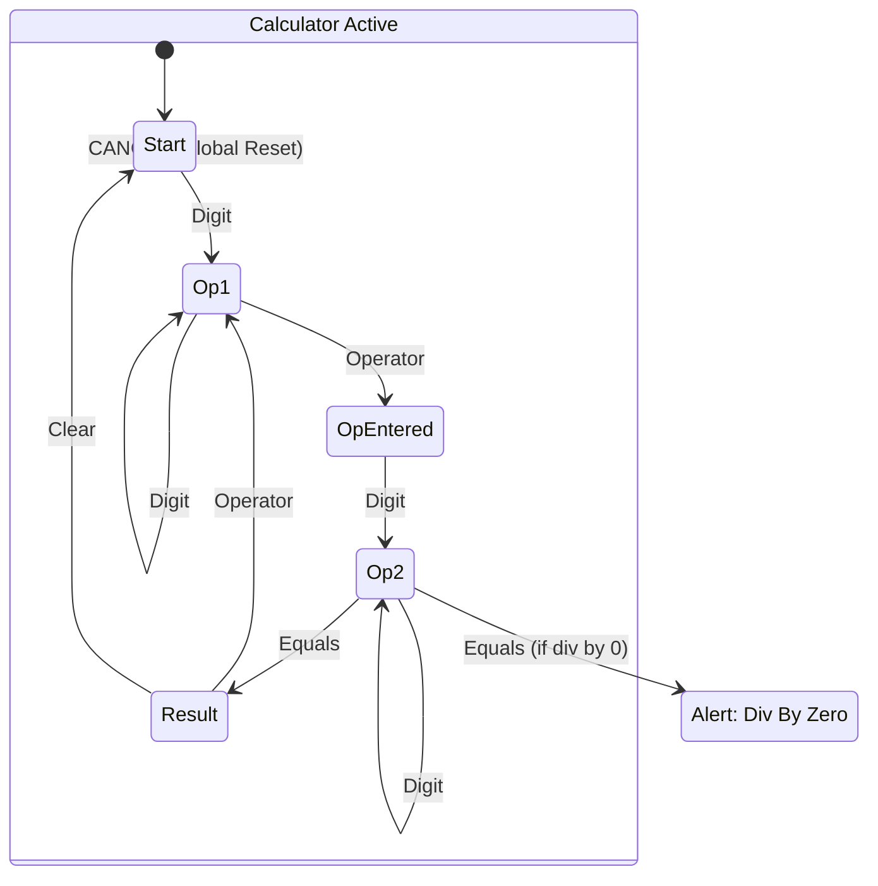

# Synopsis: Constructing the User Interface with Statecharts
**Author:** Ian Horrocks
**Source File:** Constructing_UI_Statecharts.pdf

---


## Preface
**Location:** Page 10 (Line 197)

**Summary:**
The author highlights a critical issue in software development: user interface (UI) code is often constructed in an *ad hoc*, bottom-up manner without prior design. This leads to code that is difficult to understand, maintain, and test. The book proposes a practical design technique using **Statecharts** to structure UI software effectively.

**Key Points:**
- **Problem:** UI development is often treated as a coding task rather than a design task.
- **Goal:** To provide a rigorous design method for UI software that ensures maintainability and reducibility of bugs.
- **Audience:** Professional software engineers dealing with complex, long-lived UI applications.

**Important Quote:**
> "User interface code tends to be written without there being a clear understanding of how it will all eventually work together." [Page 10, Line 202]

---

## Chapter 1: Introduction
**Location:** Page 14 (Line 269)

**Summary:**
This chapter establishes the need for a design phase in UI construction. While modern tools allow for rapid initial coding ("drag and drop"), they often result in code with poor internal structure. The chapter distinguishes between **User Interaction Design** (external behavior/look-and-feel) and **User Interface Software Construction** (internal logic/implementation). The proposed technique focuses on the latter.

**Topics:**
- **The "Ad Hoc" Trap:** Rapid development tools often mask the complexity of the underlying software, leading to "spaghetti code" in event handlers.
- **Interaction vs. Construction:** 
    - *Interaction Design:* What the user sees and does (Tasks, Screen Layout).
    - *Construction:* How the software is built to support that interaction.
- **Iterative Process:** UI design is a spiral, involving continuous feedback and modification.

**Diagram: The Focus of the Book**


**Tips:**
- Do not confuse "Screen Design" with "Software Design". A pretty screen can have terrible underlying code.
- Expect the UI to change. Design the *structure* of the software to handle change, rather than hard-coding for a specific snapshot of requirements.

---

## Chapter 2: User Interface Construction
**Location:** Page 20 (Line 450)

**Summary:**
This chapter explores the inherent complexity of **Direct Manipulation** interfaces (GUIs) compared to **Command Line Interfaces** (CLIs). It explains the tools used for construction and the **Event-Driven** nature of the resulting software.

**Topics:**
- **Complexity:** 
    - *CLI:* Synchronous. User must complete one command to start next. Syntax enforced by parser.
    - *GUI:* Asynchronous/Modeless. User can jump between tasks (e.g., type in a field, then scroll, then click menu). The software must ensure validity at all times.
- **Event-Driven Architecture:** Control flow is determined by external events (mouse clicks, key presses), not by a linear "main" program.
- **Development Tools:** 
    - *Screen Designer* (Layout)
    - *Object Navigator* (Hierarchy)
    - *Property Sheet* (Attributes)
    - *Code Editor* (Logic)

**Key Concept: Inversion of Control**
In traditional software, the program controls the flow. In event-driven UI, the *user* (via events) controls the flow.

**Diagram: Procedural vs Event-Driven**


**Important Reference:**
- **The Difficulty of Validation:** In a GUI, "The software must prevent a user leaving a file without giving it a name... The developers... are responsible for ensuring that the syntax of the interaction is always correct." [Page 22, Line 539]


---

## Chapter 3: A Bottom-Up Approach to User Interface Construction
**Location:** Page 28 (Line 725)

**Summary:**
This chapter critiques the prevalent "bottom-up" coding style where event handlers are written in isolation, connected by global variables. It uses a **Calculator Application** (Visual Basic) as a case study to demonstrate how this leads to fragile code.

**Key Points:**
- **The Event-Action Paradigm:** The belief that "Event X triggers Action Y" is too simple. In reality, "Event X triggers Action Y *if* State is Z".
- **Global Variable Hell:** To coordinate separate event handlers (e.g., Number Click vs. Operator Click), developers often use global flags (`DecimalFlag`, `LastInput`). This creates hidden dependencies.
- **Fragility:** "It is difficult to enhance such software... without introducing unwanted side-effects."
- **Case Study Analysis:** The author found 10 errors in a 100-line calculator program due to this ad-hoc logic.

**Diagram: The Bottom-Up Web**
*A user interface where every object interacts directly with every other object via global variables.*


---

## Chapter 4: The User Interface-Control-Model Architecture
**Location:** Page 37 (Line 1116)

**Summary:**
The author proposes the **UCM Architecture** to solve the bottom-up problem. This separates the application into three distinct layers: **User Interface**, **Control**, and **Model**.

**Topics:**
- **UCM Layers:**
    1.  **User Interface Layer:** The visual objects (buttons, fields). They forward events to the Control layer.
    2.  **Control Layer:** Centralized objects that maintain the **State** of the application. They decide what to do when an event occurs.
    3.  **Model Layer:** Long-term data (Database, Files).
- **Control Objects:** These are key. They "centralize the control... [and] maintain the state of the user interface as a whole."
- **Event-State-Action Paradigm:** The correct mental model for UI.
    - `Next State = F(Current State, Event)`
    - `Actions = G(Current State, Event)`

**Diagram: UCM Architecture**


---

## Chapter 5: A Design Notation for Control Layer Objects
**Location:** Page 42 (Line 1257)

**Summary:**
This chapter begins the transition to **Statecharts**. It starts by showing the limitations of **Natural Language Specifications** using a **CD Player** example. It then introduces **Finite State Machines (FSMs)** as a superior formal model.

**Topics:**
- **The Ambiguity of Text:** A detailed 27-point natural language spec for a simple CD player is presented. It is shown to be verbose, difficult to verify, and prone to misinterpretation.
- **Finite State Machines:** Defined formally as a system with a set of states, inputs, and outputs.
- **State Transition Diagrams (STD):** A classic notation for FSMs (Circles and Arrows).
    - *Mealy Model:* Actions on transitions.
    - *Moore Model:* Actions on states.

**Key Example: The CD Player Spec**
The text specification discusses states like `<No CD Loaded>`, `<CD Stopped>`, `<CD Playing>`, and rules for every button in every state. This complexity (implosion of states) sets the stage for why Standard STDs fail and **Statecharts** are needed.

**Why State Transition Diagrams (STDs) Fail:**
1.  **Explosion of States:** Adding a feature like "Stepping Forward" requires duplicating states.
2.  **Duplication:** Events like "Eject" must be drawn from every single state.
3.  **Lack of Scalability:** STDs become "chaotic" and unreadable for even small apps like a CD player.

**Statecharts to the Rescue:**
- **Hierarchy (Nesting):** You can have a state `CD Loaded` which contains `Stopped`, `Playing`, `Paused`. An event like `Eject` can be drawn *once* from the `CD Loaded` boundary, applying to all substates automatically.
- **History Mechanism (H):** Allows returning to the "last active substate". E.g., if you leave `Playing` to go to `Configuration`, the History state remembers you were `Playing`.

**Diagram: Hierarchy & History**


---

## Part 2: User Interface Software Design
**Location:** Page 59 (Line 2358)

**Summary:**
This section shifts focus from concepts to the practical application of Statecharts. It emphasizes that this is about **designing the software behavior**, not the user experience tasks. It outlines the four needs of a designer: Data Notation, Practical Advice, Design Techniques, and Design Heuristics.


---

## Chapter 6: The Statechart Notation
**Location:** Page 72 (Line 2406)

**Summary:**
This chapter defines the syntax and semantics of Statecharts, based on David Harel's work (1987). It details how Statecharts overcome the limitations of simple FSMs.

**Topics:**
- **Depth (Refinement):** States can contain other states (Parent/Child). This allows zooming in/out of abstraction levels.
- **Clustering:** Grouping states inside a super-state allows a single event arrow to apply to all of them (reducing clutter).
- **Concurrency (Orthogonal Regions):**
    - A system can be in multiple states simultaneously if they are in orthogonal components (separated by dashed lines).
    - Example: Text formatting (Bold/Italic/Underline) is best modeled as 3 concurrent regions, not $2^3=8$ separate states.
- **History Mechanism:** Remembering the last active substate.
- **Delays/Time-outs:** Transitions triggered by time passing.

**Diagram: Concurrency**


---

## Chapter 7: The Pragmatics of the Statechart Notation
**Location:** Page 90 (Line 2776)

**Summary:**
Practical advice on naming, organizing, and documenting Statecharts.

**Topics:**
- **Naming:** Give states meaningful names (e.g., `CD_Playing`) but use numerical IDs for tables.
- **State Variables:** You need variables to track position in the hierarchy (e.g., `State_Level_1 = A`, `State_Level_2_within_A = C`).
- **Event-Action Tables:** Don't crowd the diagram. Use a side table to list `Event -> Action -> Next State`.
- **State-Item Tables:** Define the properties of UI objects (Enabled/Disabled, Visible/Invisible) for each state.

**Tip:**
- Break large Event-Action tables into modules (e.g., one per screen).

---

## Chapter 8: Standard Design Techniques
**Location:** Page 96 (Line 2995)

**Summary:**
A toolkit of patterns to solve common design problems and keep diagrams clean.

**Techniques:**
1.  **Divide and Conquer:** Use concurrency to split independent behaviors.
2.  **Clustering:** If 5 states all go to "Exit" on the "Close" event, put them in a Super-State and draw "Close" once.
3.  **Transient States:** States that evaluate a condition immediately and move on (Logic branching).
4.  **Modal Alerts:**
    - Problem: Alerts (like "Save changes?") suspend the main app.
    - Solution: A specific state for the Alert.
    - Optimization: Use **Parameterized States** for generic alerts to avoid creating a new state for every single error message.

**Diagram: Clustering Example**


---

## Chapter 9: Design Heuristics and Design Tests
**Location:** Page 106 (Line 3251)

**Summary:**
This chapter provides a set of heuristics (rules of thumb) for designing effective Statecharts and tests to validate them.

**Heuristics:**
- **Identify High-Level States first:** Start with main screens or canvases.
- **Identify Modes:** Look for "Edit Mode" vs "View Mode" or "User Privileges" (Admin vs Guest). These are natural high-level states.
- **Independence:** Keep concurrent parts truly independent. Avoid conditions like `if (in state X)` across concurrent regions. If heavily dependent, merge them.
- **Actions on Events, Not States:** Do not put actions on *entry* to a state (like "OnEnter: Execute SQL"). Put them on the *event* arrow. States should represent a static condition (e.g., "Field X is Visible"), not a trigger for code execution.
- **Avoid "Jumping" Levels:** Event arrows should generally move between states at the same level of hierarchy.

**Design Tests:**
1.  **Completeness:** Is every UI item accounted for in every state?
2.  **Reachability:** Can every state be reached? Are there any "dead" states you can't exit?
3.  **Determinism:** If an event occurs, is there *exactly one* valid transition? Beware of ambiguous conditions (e.g., `x > 0` and `x = 0` are distinct, but `x > 0` and `x > 5` overlap).
4.  **No Order Dependency:** Never rely on the order in which "simultaneous" concurrent events occur.

---

## Part 3: Case Studies
**Location:** Page 124 (Line 3848)

## Chapter 10: Case Study 1: A Calculator
**Location:** Page 126 (Line 3922)

**Summary:**
Revisits the Calculator example from Chapter 3, but this time designs it correctly using Statecharts.

**Key Design Features:**
- **Hierarchical States:** `Operand 1` and `Operand 2` states handle the input of numbers.
- **Handling Negatives:** A specific `Negative Number` state handles the minus sign entry before digits.
- **Division by Zero:** Modeled as a high-priority transition to an `Alert` state.
- **Cancel:** A top-level "Cancel" event (attached to the outermost state) handles checking out/resetting the app from *anywhere*.

**Diagram: Calculator Statechart (Simplified)**


---

## Chapter 11: Case Study 2: A Fault Reporting Application
**Location:** Page 134 (Line 4044)

**Summary:**
Designs a workflow system for tracking software bugs. Demonstrates how Statecharts handle **Roles** (Permission-based logic) and **Lifecycles**.

**Key Features:**
- **Roles:** Originator, Analyst, Implementer.
- **Workflow:** `New -> Raised -> Evaluated -> Implemented -> Fixed/Not Fixed`.
- **Screen Modes:** The UI behavior (Enabled/Disabled fields) changes based on the matrix of {Current Role, Current Status}.
    - *Example:* An "Analyst" can edit a "Raised" fault, but an "Originator" cannot.
- **Statechart Strategy:**
    - Top Level: Lifecycle States (View FR, New FR).
    - Lower Level: Concurrent regions for each Tab (Description, Analysis, Testing) to handle field-level validation.

**Heuristic Applied:**
- **Transient States:** Used to check "Role + Status" immediately upon loading a record to decide which "Mode State" to enter.

---

## Chapter 12: Case Study 3: A Student Database
**Location:** Page 156 (Line 4676)

**Summary:**
Designing a system for College Admissions. Focuses on interacting screens (Summary Screen <-> Details Screen).

**Context:**
- Tracks student application lifecycle: `Applied -> Interviewed -> Offer Made -> Accepted -> Enrolled`.
- **Two Screens:**
    1.  **Summary:** List of students (Filter/Report).
    2.  **Details:** Full form for a single student.

**Detailed Design:**
- **Summary Screen:**
    - *List Logic:* State machine tracks if "List is Empty" or "List has Items".
    - *Button Logic:* `Edit` and `Delete` buttons are only enabled in the "List has Items" state.
    - *Transient States:* Used to fetch data on load and immediately branch to "Empty" or "Has Items".
- **Details Screen (Tabs):**
    - **A Levels:** Status fields are disabled until a Subject is selected.
    - **GCSEs:** Two lists (Available vs Selected). Buttons (`Add`, `Remove`) enable/disable based on which list has items.
    - **Interview:** Enforces strict order: `Offer Status` must be set before `Acceptance Status` is enabled.

---

## Part 4: Coding, Testing and Evaluation
**Location:** Page 184 (Line 5517)

## Chapter 13: Coding a Statechart
**Location:** Page 186 (Line 5531)

**Summary:**
Translates the visual Statechart into code. Promotes a clear separation between **Control Objects** (Logic) and **UI Objects** (Presentation).

**Implementation Strategy:**
- **Control Objects:**
    - **Public Interface:** Event Handlers (e.g., `UserClickButtonA()`).
    - **Private State:** Variables to track current state (e.g., `state_var_1 = 29`).
    - **State Procedures:** Methods like `go_to_state_29()` that set the UI attributes (Visible/Enabled) for that specific state.
- **Golden Rule:** State procedures must NOT contain conditional logic (`if`). They should just apply the static properties of that state. If you need logic, use a *Transient State* or an event handler to decide which state to go to.
- **Transient States in Code:** Implemented as procedures that run logic and immediately call another `go_to_state_X()` without waiting for user input.

**Pseudo-code Example:**
```python
class Controller:
    state = "Start"
    
    def on_click_button(self):
        # Event Handler calls logic based on current state
        if self.state == "Start":
            self.go_to_state_loading()
            
    def go_to_state_loading(self):
        # State Procedure: Sets UI only
        self.state = "Loading"
        ui.spinner.show()
        ui.button.disable()
        # Transient logic acts immediately
        data = fetch_db()
        if data:
            self.go_to_state_ready()
        else:
            self.go_to_state_empty()
```

---

## Chapter 14: Testing Statecharts
**Location:** Page 200 (Line 5981)

**Summary:**
Because Statecharts provide a clear map of all possible paths, they enable **Structural (White Box) Testing**.

**Key Concepts:**
- **Path Testing:** Verify every state transition occurs.
- **Multiple-Condition Coverage:** If a transition depends on `A=1 AND B=2`, you must test all combinations (True/False, False/True, etc.) to ensure the logic is robust.
- **Dead States:** Use traversal algorithms to ensure no state is a "black hole" (cannot be exited).
- **Debug Window:** Recommend adding a debug panel to the app that shows the specific State ID (e.g., `State: 29`) to make verification easy.

---

## Chapter 15: Evaluation
**Location:** Page 210 (Line 6319)

**Summary:**
Validates the approach based on real-world projects.

**Findings:**
- **Reduced Bugs:** Projects using Statecharts had 10-20% of the bug count of traditional bottom-up projects.
- **Maintainability:** Adding features (like changing the Fault Lifecycle in Ch11) was significantly easier because logic was centralized.
- **Trade-off:**
    - **Design Phase:** Takes longer (50%+ of project time).
    - **Coding/Testing:** Much faster.
    - **Net Result:** Higher quality software in similar timeframe.

---
**END OF SYNOPSIS**
