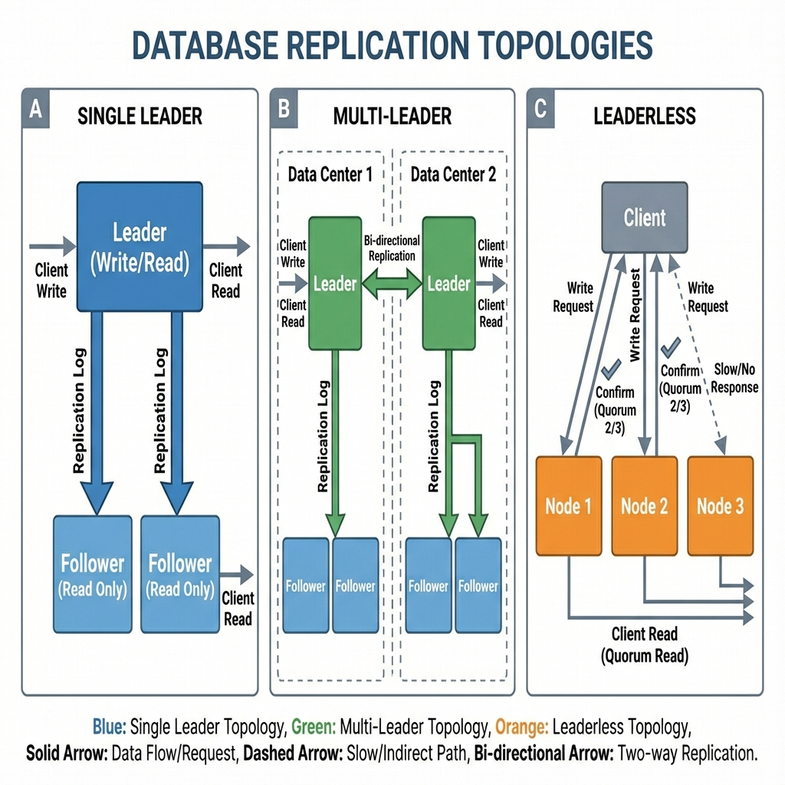
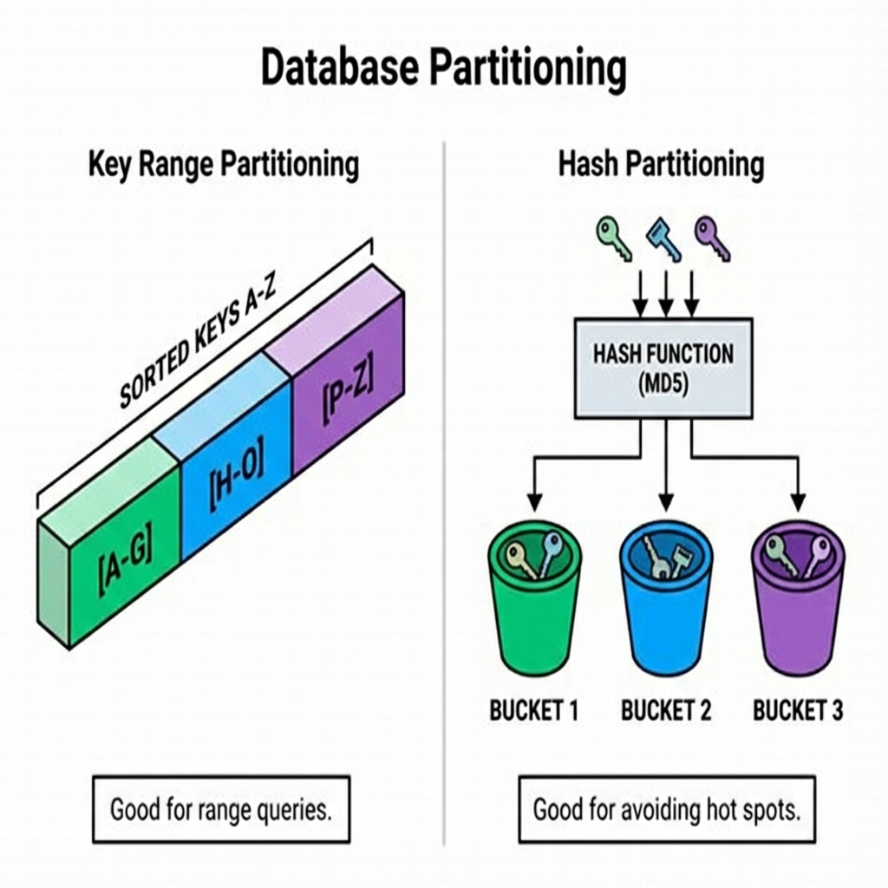
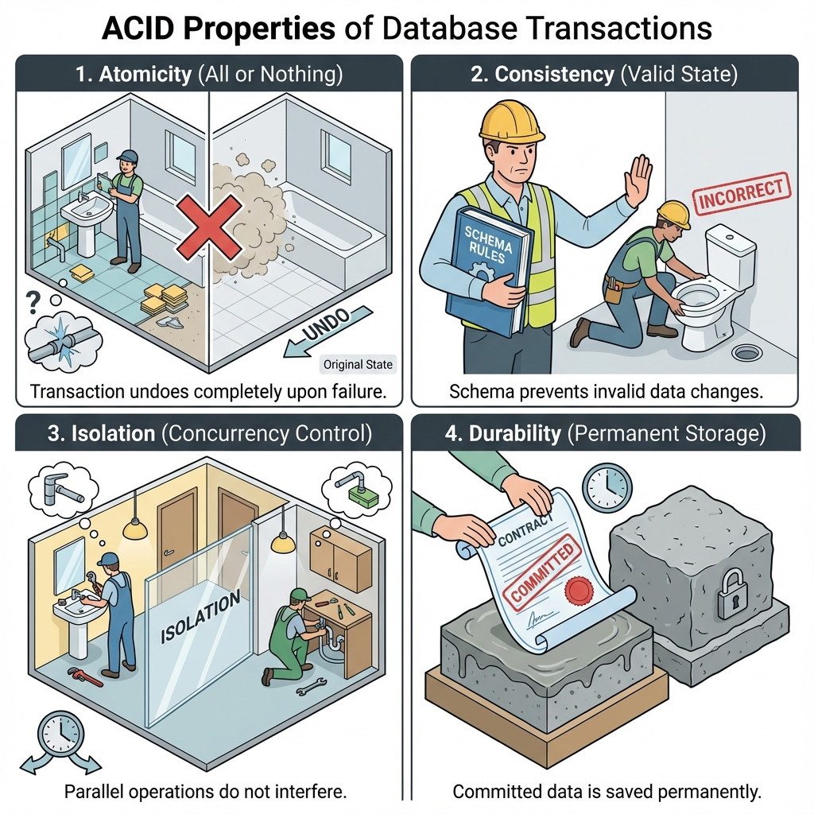
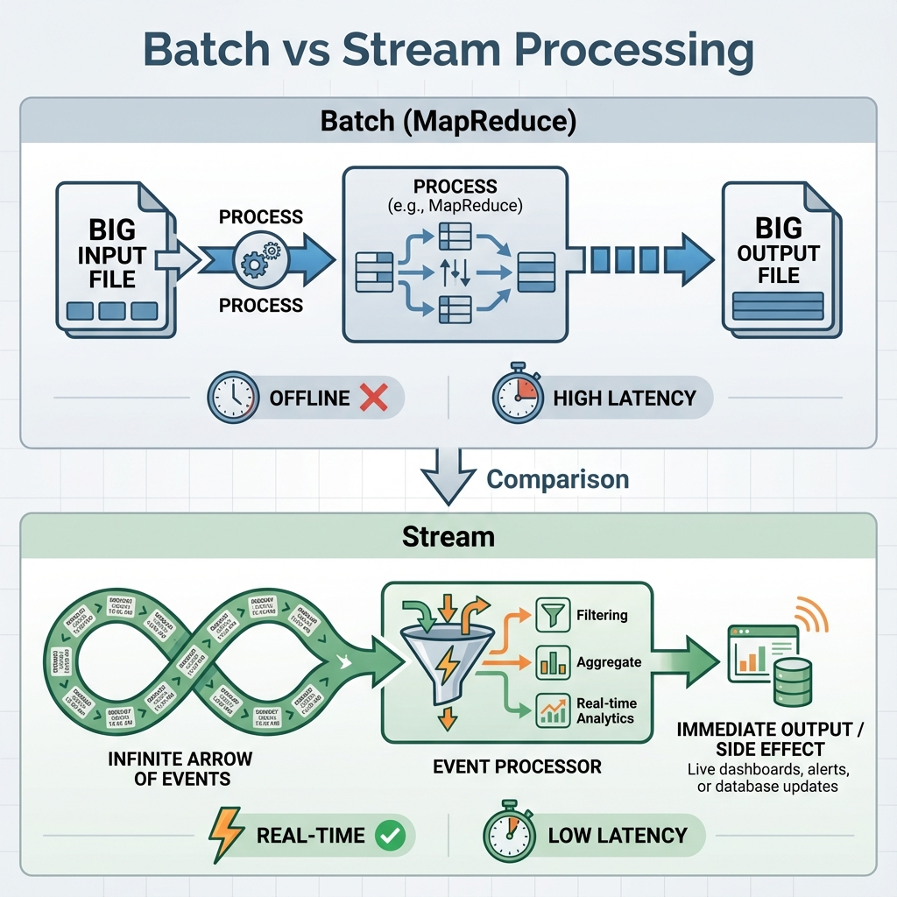

# Synopsis: Designing Data-Intensive Applications
- Author: Martin Kleppmann
- Year: 2017
- Publisher: O'Reilly Media
- Summary By: Antigravity

---

## Part 1: Foundations of Data Systems

This first section lays the groundwork by defining the three pillars of software systems: Reliability, Scalability, and Maintainability. It then explores the different data models available and how data is encoded for storage and transport.

### Chapter 1: Reliability, Scalability, and Maintainability

- **Reliability:** The system should continue to work correctly (performing the correct function at the desired level of performance) even in the face of adversity (hardware faults, software faults, human error). It's not about preventing faults but preventing *failure* due to faults.
- **Scalability:** As the system grows (in data volume, traffic complexity, or response time requirements), there should be reasonable ways of dealing with that growth. We measure this using "Load Parameters" (e.g., requests per second, write/read ratio).
- **Maintainability:** Over time, many different people will work on the system. It should be designed so that it is easy to find and fix bugs (Simplicity), operate the system (Operability), and adapt it to new requirements (Evolvability).

### Chapter 2: Data Models and Query Languages

The "impedance mismatch" between application code (objects) and storage (tables/documents) is a core challenge.
- **Relational Model (SQL):** Data is organized into relations (tables). This is best for structured data with strict schemas and complex joins. It provides strong consistency guarantees.
- **Document Model (NoSQL):** Data is stored in self-contained documents (JSON/XML). This offers better locality (all data for a user in one place) and schema flexibility ("Schema-on-Read"), making it ideal for rapid prototyping or diverse data structures.
- **Graph Model:** Best for highly connected data where the *relationships* (edges) are just as important as the data (nodes), such as social networks or fraud detection systems.

---

## Part 2: Distributed Data

This is the core of the book, discussing how to scale data across multiple machines.

### Chapter 5: Replication

Replication keeps a copy of the same data on multiple machines serving two purposes: keeping data geographically close to users (latency) and allowing the system to work even if parts fail (availability).

> **Metaphor: The Job Site Blueprints**
> Think of Replication as having multiple copies of the Master Blueprint.
> *   **Single Leader:** The General Contractor (Leader) marks changes on the Master. All Apprentices (Followers) just copy what the GC marked.
> *   **Multi-Leader:** Two GCs on different floors mark their own prints. If they disagree on a wall location, they have a "Conflict" that must be resolved later.

- **Single-Leader:** All writes go to one node (Leader). Reads can go to any node (Followers). This is simple and consistent but the Leader is a bottleneck and single point of failure for writes. Common in MySQL, PostgreSQL.
- **Multi-Leader:** Use more than one node to accept writes. This is necessary for multi-datacenter setups (surviving the loss of a whole DC) or offline clients (e.g., Calendar apps). It introduces complex "Write Conflicts" (two users editing the same document at the same time), which must be resolved (Last Write Wins, Manual Resolution).
- **Leaderless (Dynamo-style):** Clients send writes to several nodes at once. Reads are also sent to several nodes to detect stale data using "Read Repair" (client fixes stale data) or "Anti-entropy" (background process). It relies on Quorum consensus (e.g., if 3 replicas exist, you might need 2 to confirm a write). Used in Cassandra, Riak.

### Chapter 6: Partitioning

Partitioning (or Sharding) breaks a large dataset into smaller chunks so it can fit on one machine.

> **Metaphor: Assigning Units to Wings**
> A single plumber can't service a 100-story building alone.
> *   You split the work: "Wing A handles Units 1-50, Wing B handles Units 51-100."
> *   This is **Partitioning**. Each Wing acts independently.

- **Key Range Partitioning:** Assigns a continuous range of keys (e.g., A-G) to a partition. This keeps keys sorted, enabling efficient range scans, but can lead to "Hot Spots" if certain keys (like "The" in an index) are accessed disproportionately.
- **Hash Partitioning:** A hash function determines the partition. This distributes load evenly, preventing hot spots, but destroys the ordering of keys, making range queries inefficient (you must query all partitions).

### Chapter 7: Transactions

A transaction groups multiple operations into a single logical unit.

- **Atomicity (The "All-or-Nothing Renovation"):** Imagine you are installing a new bathroom. You have opened the wall, removed the old pipe, and are about to put in the new one. Suddenly, the water main bursts. Atomicity guarantees that you don't leave the house in a destroyed state. If the job fails halfway, you essentially "undo" reality—the wall is back up, the old pipe is back, as if you never started.
- **Consistency (The "Building Code"):** The database has rules (invariants) just like a building has code. You cannot install a toilet where there is no drain line. If you try to commit a transaction that violates these rules (e.g., negative balance), the database rejects it, ensuring the "building" always remains habitable and up to code.
- **Isolation (The "Two Plumbers" Rule):** Two plumbers (transactions) are working on the same apartment. Isolation prevents Plumber A from turning on the water main while Plumber B still has the valve open. It ensures that even if they work at the same time, they don't see each other's half-finished work.
- **Durability (The "Dried Concrete"):** Once you tell the client "The job is done" (Commit), it is permanent. Like concrete setting, even if the power goes out 1 second later, that foundation isn't moving. The record is written to disk (the structure) and survives crashes.

---

## Part 3: Derived Data

This section moves beyond "systems of record" (databases) to deriving new datasets from existing ones.

### Chapter 10: Batch Processing (MapReduce)

Batch processing is like a unix pipe: it takes a large bounded input (e.g., yesterday's logs), processes it, and produces an output, without modifying the input.
- **MapReduce:** A programming model for processing big data sets with a parallel, distributed algorithm on a cluster.
- **Dataflow Engines:** Modern tools like Spark and Flink improve on MapReduce by keeping intermediate state in memory rather than writing to disk after every step.

### Chapter 11: Stream Processing

- **Unbounded Data:** Unlike batch, streams never end.
- **Event Time vs Processing Time:** A critical distinction. Processing time is when your machine sees the event; Event time is when it actually happened. Good systems handle "late-arriving data" by using watermarks.
- **Complex Event Processing (CEP):** Searching for patterns in a stream (e.g., "If event A is followed by event B within 5 minutes").

---

## Glossary

### ACID
A set of properties (Atomicity, Consistency, Isolation, Durability) that guarantee that database transactions are processed reliably.

### CAP Theorem
A theorem stating that a distributed system can only provide two of the three guarantees: Consistency, Availability, and Partition Tolerance.

### Hot Spot
A situation in partitioning where a single node receives a disproportionate amount of load (storage or traffic), effectively becoming a bottleneck.

### Idempotence
A property of an operation whereby ensuring that the result is the same whether it is executed once or multiple times. This is critical for reliable retry mechanisms.

### Linearizability
A consistency model where the system behaves as if there were only one copy of the data, and all operations on it are atomic.

### Quorum
In leaderless replication, the minimum number of votes required to consider an operation successful (e.g., `(n/2) + 1`).

### Sharding
See [Partitioning](#partitioning).

### Split Brain
A scenario in a clustered system where network failure results in two or more nodes each believing they are the only active leader, potentially leading to data corruption.

### WAL (Write-Ahead Log)
An append-only file where all modifications are written before they are applied to the actual database files, ensuring durability in case of a crash.

---

## References

- Kleppmann, M. (2017). *Designing Data-Intensive Applications*. O'Reilly Media.
- **Replication strategies:** Chapter 5.
- **Partitioning schemes:** Chapter 6.
- **Batch vs Stream:** Chapters 10 & 11.
