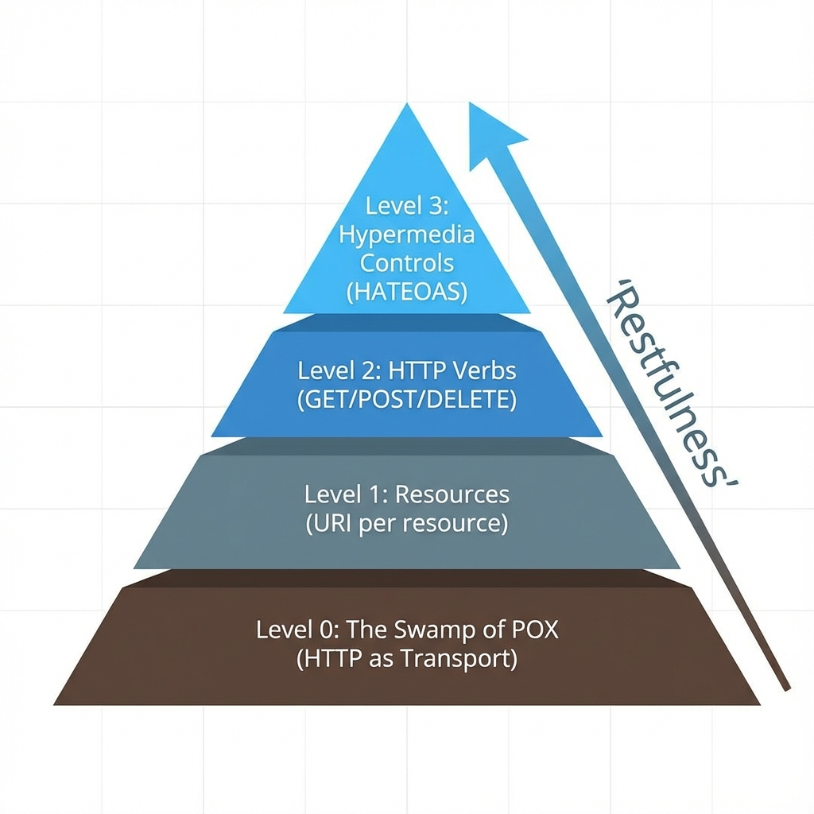
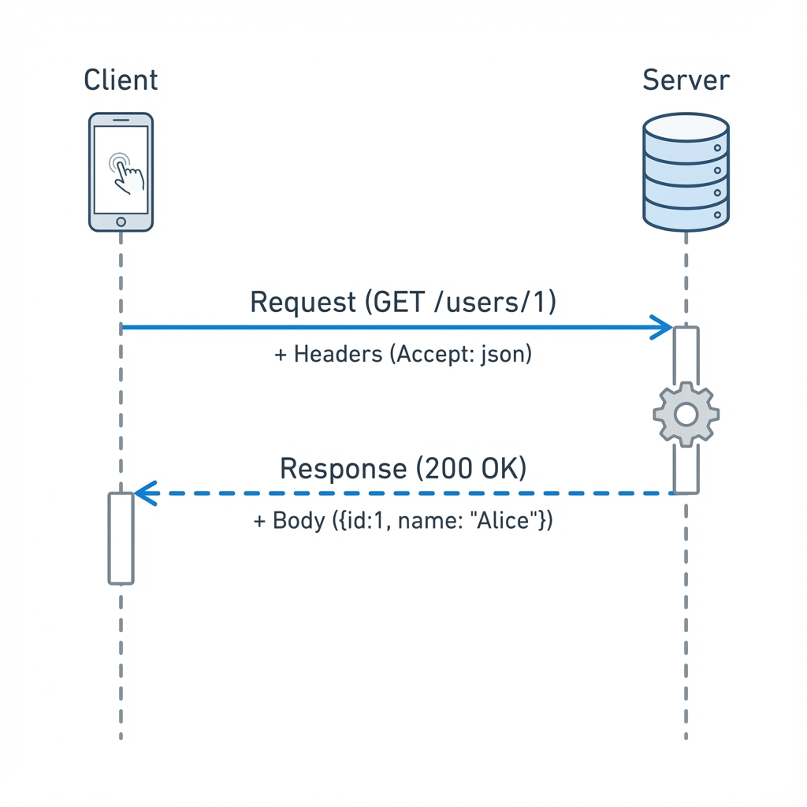

# Synopsis: Hands-On RESTful API Design Patterns
- Author: Harihara Subramanian
- Year: 2019
- Publisher: Packt
- Summary By: Antigravity

---

## Part 1: Fundamentals of REST

This section introduces the core principles of [REST](#rest) (REpresentational State Transfer) and the underlying protocols that make the web work.

### Chapter 1: REST Architecture

REST is not a protocol but an architectural style. It relies on a client-server relationship where the server manages resources and the client interacts with them via a uniform interface.
- **Statelessness:** The server does not store any client context between requests. Every request must contain all the information necessary to understand and process it (e.g., authentication tokens). This improves reliability and scalability.
- **Cacheability:** Responses must define themselves as cacheable or not. This prevents clients from reusing stale data and reduces load on the server.
- **Uniform Interface:** The consistent use of resource identifiers (URIs) and standard methods (GET, POST) allows any client to interact with any server without custom code.



### The Richardson Maturity Model
A way to grade APIs on how "RESTful" they are.
- **Level 0 (The Swamp of POX):** Using HTTP effectively as a transport protocol (like Remote Procedure Calls). typically using one endpoint (`/service`) and POSTing XML commands.
- **Level 1 (Resources):** Breaking the application into distinct resources (`/users`, `/products`), but often still using only GET/POST incorrectly.
- **Level 2 (HTTP Verbs):** Using the protocol correctly. GET for safe retrieval, POST for creation, DELETE for removal. Status codes (200, 404, 500) are used meaningfully.
- **Level 3 (Hypermedia Controls):** The "Glory of REST". The API response includes links ([HATEOAS](#hateoas)) telling the client what they can do next (e.g., "next_page", "cancel_order"), driving the application state.

### Chapter 2: HTTP Basics



The web is built on the Request-Response cycle.
- **Methods:**
    - `GET`: Retrieve a representation of a resource. Safe and Idempotent.
    - `POST`: Create a new sub-resource (e.g., add a user). Not Idempotent.
    - `PUT`: Update/Replace a resource entirely. Idempotent.
    - `PATCH`: Partially update a resource.
    - `DELETE`: Remove a resource.
- **Status Codes:**
    - `2xx`: Success (200 OK, 201 Created).
    - `3xx`: Redirection (301 Moved Permanently).
    - `4xx`: Client Error (400 Bad Request, 401 Unauthorized, 404 Not Found).
    - `5xx`: Server Error (500 Internal Server Error).

---

## Part 2: Design Patterns

### Chapter 4: Resource Naming and Structure

Choosing good URIs is critical for long-term maintainability.
- **Nouns, not Verbs:** URIs should identify *things* (resources), not *actions*.
    - Bad: `POST /createUser`, `GET /getProducts`
    - Good: `POST /users`, `GET /products`
- **Pluralization:** Use plurals for collections (`/users`) and singulars for specific items via ID (`/users/123`).
- **Hierarchy:** Use sub-paths to show relationships. `/users/123/orders` clearly implies "orders belonging to user 123".

**Example: Designing a Product Catalog**
```http
// Get all products (Collection)
GET /products HTTP/1.1
Accept: application/json

// Get a specific product (Item)
GET /products/42 HTTP/1.1

// Create a new product (Non-Idempotent)
POST /products HTTP/1.1
Content-Type: application/json

{
  "name": "Super Widget",
  "price": 29.99
}
```

### Chapter 6: Versioning Strategies

APIs evolve. You need a strategy to introduce breaking changes without crashing existing clients.
- **URI Versioning:** `GET /v1/users`. Explicit and visible, but technically violates the principle that a "Resource" stays the same even if the representation changes.
- **Header Versioning:** `Accept: application/vnd.company.v1+json`. This is the "Pure REST" way, keeping URLs clean, but is harder to test in a browser.
- **Query Parameter:** `GET /users?version=1`. Simple but can look messy.

**Code Example: HATEOAS Response (Level 3)**
Instead of just returning data, the API returns *links* to valid next states.
```json
{
  "id": 123,
  "status": "pending_payment",
  "total": 50.00,
  "_links": {
    "self": { "href": "/orders/123" },
    "payment": { "href": "/orders/123/pay", "method": "POST" },
    "cancel": { "href": "/orders/123", "method": "DELETE" }
  }
}
```
*Note how the client logic doesn't need to hardcode "DELETE /orders/123" to cancel. It just follows the `cancel` link found in the response.*

### Chapter 8: Security (OAuth 2.0)

Security should never be an afterthought.
- **Authentication:** Verifying *who* the user is. Basic Auth (username:password) is insufficient for modern apps.
- **Authorization:** Verifying *what* the user is allowed to do.
- **OAuth 2.0:** The industry standard for delegation. It allows a user to grant a third-party application access to their resources without sharing their password. It uses "Access Tokens" (often [JWTs](#jwt)) to prove authorization with every request.

---

## Glossary

### HATEOAS
**Hypermedia As The Engine of Application State**. A constraint of REST architecture where the client interacts with the network application entirely through hypermedia (links) provided dynamically by application servers.

### Idempotence
The property that multiple identical requests have the same effect as a single request. (e.g., `DELETE /users/1` is idempotent; doing it 10 times results in the same state: user deleted).

### JWT
**JSON Web Token**. A compact, URL-safe means of representing claims to be transferred between two parties. Often used for stateless authentication.

### POX
**Plain Old XML**. A term used to describe basic XML over HTTP techniques that do not follow REST principles (often just using HTTP as a tunnel).

### REST
**REpresentational State Transfer**. An architectural style for providing standards between computer systems on the web, making it easier for systems to communicate with each other.

### URI
**Uniform Resource Identifier**. A string of characters that unambiguously identifies a particular resource.

---

## References

- **Maturity Model:** Chapter 1.
- **HTTP Status Codes:** Chapter 2.
- **Naming Conventions:** Chapter 4.
- **Security Patterns:** Chapter 8.
