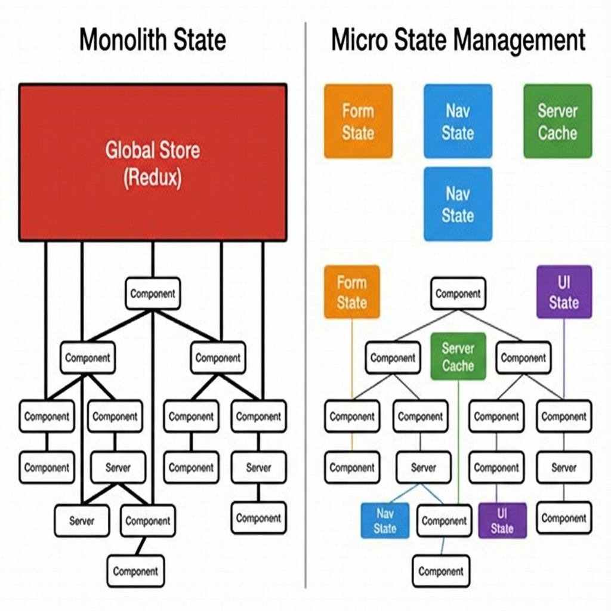
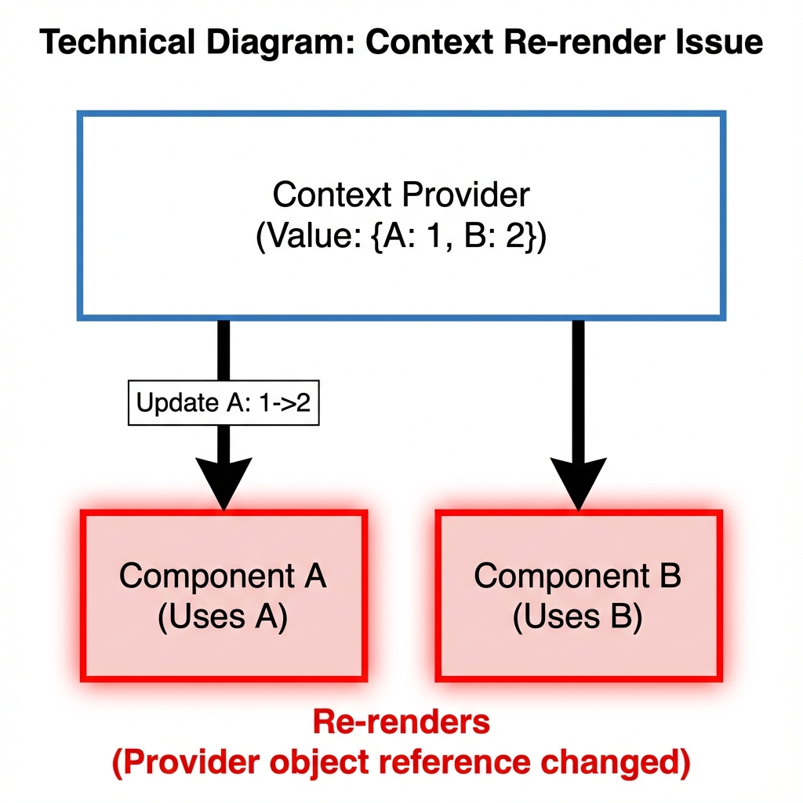
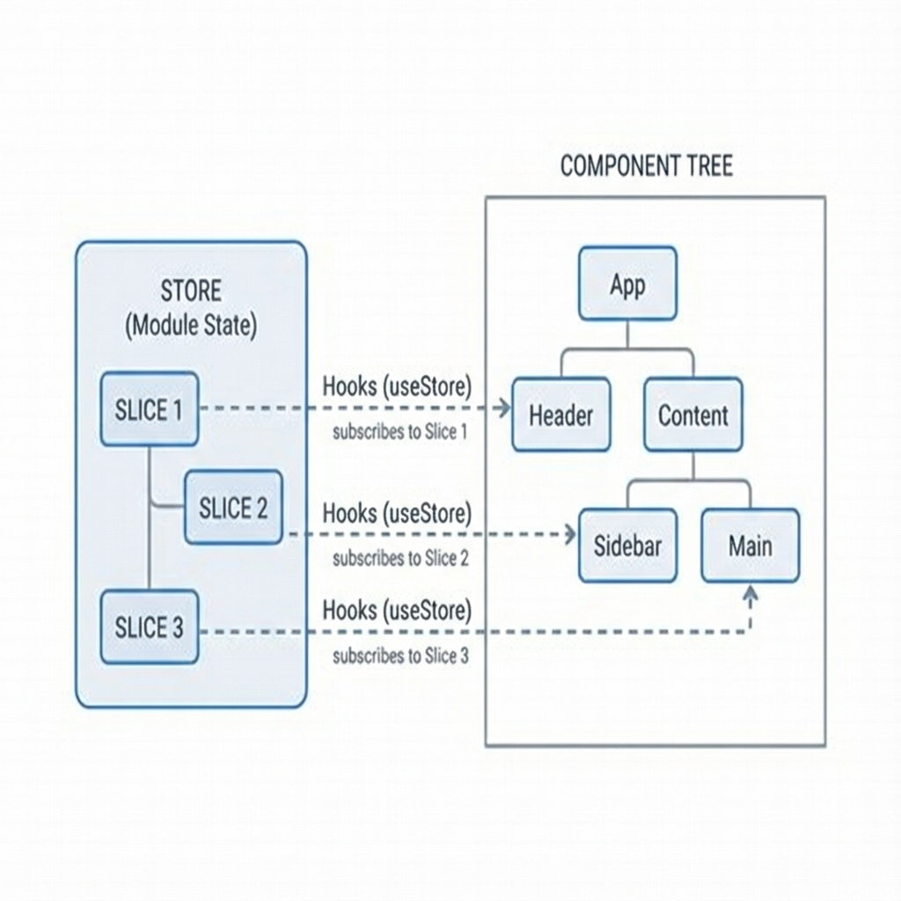
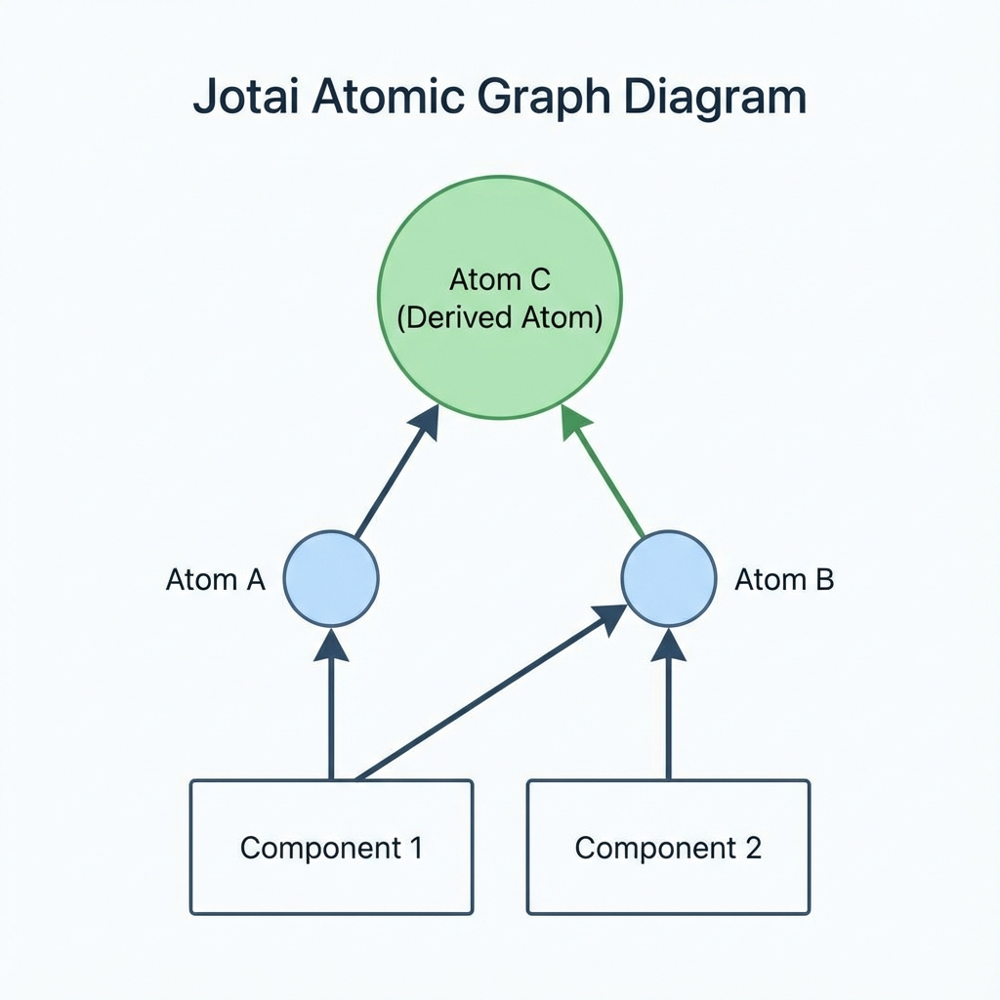
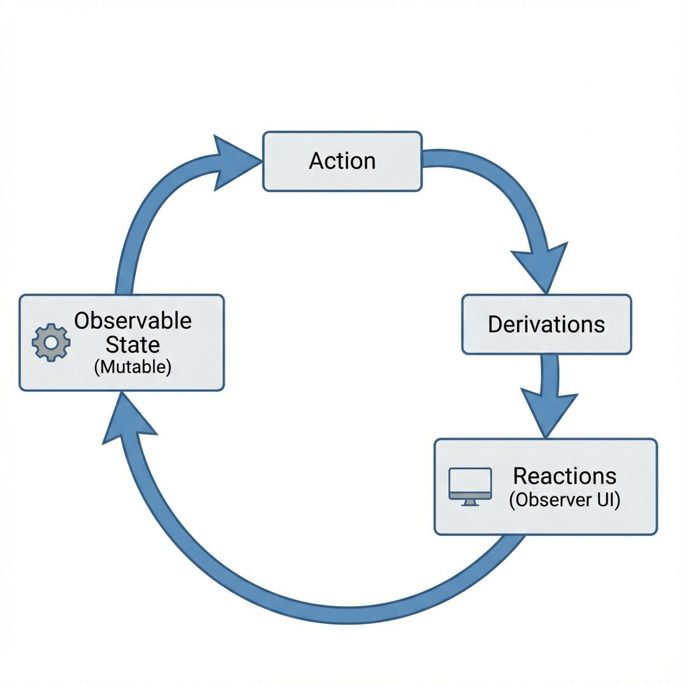

# Synopsis: Micro State Management with React Hooks
- Author: Daishi Kato
- Year: 2022
- Publisher: Packt
- Summary By: Antigravity

---

## Executive Summary

This book provides a deep technical dive into state management patterns in React, transitioning from monolithic solutions to lightweight, purpose-built "micro" state management. It explores the implementation details of custom state libraries, the mechanics of React's [Concurrent Mode](#concurrent-mode), and how to optimize re-renders using techniques like "Lifting State Up," [Context](#context), and [Subscription](#subscription) patterns. The text compares modern libraries such as Zustand, Jotai, and MobX to help developers choose the right tool for specific problems like Form State, Server Cache, or UI State.

---

## Part 1: React Hooks and Micro State Management

### Chapter 1: What is Micro State Management?

"Micro" state management refers to the practice of using lightweight, highly specific solutions for different types of state, rather than dumping everything into a single global store.



- **The Problem with Monoliths.** Historically, libraries like [Redux](#redux) encouraged a single global store. While predictable, this often leads to performance bottlenecks (unnecessary re-renders) and coupling. If a "Form Component" and a "Navigation Component" both depend on the same giant state object, a change in one might accidentally trigger an update in the other.
- **The Micro Alternative.** In modern React, we split state by purpose. Form state might live in a local `useReducer` or a library like `React Hook Form`. Server data acts as a cache (e.g., React Query). Global UI state (like Dark Mode) lives in a small Context or an Atomic store. This separation concerns makes the app more resilient and performant.

### React Hooks Basics
- `useState`: The fundamental unit of local state. It supports **Lazy Initialization** (`useState(() => expensiveComputation())`) to avoid performance penalties on initial render. It also implements **Bailout**, meaning if you update state to the *same* value (`setState(prev => prev)`), React skips the re-render.
- `useReducer`: Designed for complex state logic where the next state depends on the previous one. Because the reducer function is pure, it is easy to test in isolation from the component.
- `useEffect`: The escape hatch for side effects. It runs after the render commit phase.

### Concurrent Features
React 18 introduced [Concurrent Mode](#concurrent-mode), which allows React to interrupt rendering to handle high-priority events (like user input).
- [Suspense](#suspense): Allows components to "wait" for async data before rendering. It decouples fetching logic from standard loading state logic.
- **Tearing:** A graphical glitch where the UI shows inconsistent states (e.g., Header shows "Logged In" while Body shows "Logged Out") during a concurrent render. State libraries must use `useSyncExternalStore` to prevent this.

---

## Part 2: Basic Approaches to the Global State

### Chapter 2: Local vs Global State
The first step in optimization is knowing *where* state belongs.
- **Local State** belongs to a single component. If only the "Accordion" component cares about whether it is open or closed, that state should never leave the component.
- **Global State** shared across the component tree. This is difficult in native React because "Prop Drilling" (passing data down 10 layers) makes code brittle and hard to refactor.

### Chapter 3: Sharing State with Context
[Context](#context) is React's native solution for dependency injection, but it comes with a major performance pitfall.



- **The Re-render Trap.** Use the diagram above. If a Context Provider holds an object `{ A: 1, B: 2 }`, and you update `A` to `3`, React creates a *new object reference*. All components consuming that Context will re-render, *even Component B which only cares about B*.
- **Solution:** Split your Contexts. Create a `CountProvider` for numbers and a `UserProvider` for auth. This reduces the "Blast Radius" of a state update.

### Chapter 4: Module State and Subscriptions
To avoid React's render lifecycle constraints entirely, we can move state *outside* of React.
- **Module State.** This is simply a variable defined in a JavaScript file (e.g., `let count = 0`). It is a singleton.
- **Subscription Pattern.** Since React doesn't know when a normal Javascript variable changes, we need a bridge. We create a `store` with a `subscribe` method. Components use a `useEffect` to subscribe to the store and a local `useState` to trigger a re-render when the store notifies them of a change.

---

## Part 3: Library Implementations

This section compares three major libraries: [Zustand](#zustand), [Jotai](#jotai), and [MobX](#mobx). Each takes a fundamentally different philosophical approach to state management.

### Chapter 6: Zustand (Module State + Immutable)

[Zustand](#zustand) ("State" in German) connects React components to an external, immutable store. It is extremely minimalist and unopinionated.



- **How it works:** You define a global hook (e.g., `useStore`). The store lives *outside* the React component tree (Module Scope), meaning it is accessible anywhere, even outside of React components.
- **Mental Model:** It is like a global `useState` that can be subscribed to.
- **Optimization:** You select only the specific "slice" of state you need. `useStore(s => s.bears)` will only re-render if the number of bears changes, ignoring changes to 'fish' or 'dragons'.

**Code Example:**
```javascript
import create from 'zustand';

// 1. Create a store (Module Scope)
const useStore = create((set) => ({
  bears: 0,
  increasePopulation: () => set((state) => ({ bears: state.bears + 1 })),
}));

// 2. Bind to Component
function BearCounter() {
  // Selector: Re-renders ONLY when 'bears' changes
  const bears = useStore((state) => state.bears);
  return <h1>{bears} around here ...</h1>;
}
```

### Chapter 7: Jotai (Atomic State)

[Jotai](#jotai) ("State" in Japanese) uses an atomic model, similar to Recoil. It is designed to solve the [Context re-render issue](#context-re-render-issue) while keeping the state inside the React component tree (Component Scope).



- **How it works:** You define small, independent pieces of state called "atoms". Atoms can depend on other atoms, forming a dependency graph.
- **Mental Model:** It is like having thousands of tiny `useState` hooks that are globally accessible.
- **Derived Atoms:** You can create an atom that automatically calculates its value based on another atom. If the upstream atom changes, the downstream atom updates automatically.

**Code Example:**
```javascript
import { atom, useAtom } from 'jotai';

// 1. Define Atoms
const textAtom = atom('hello');
const lenAtom = atom((get) => get(textAtom).length); // Derived

// 2. Use in Component
function CharacterCounter() {
  const [len] = useAtom(lenAtom);
  return <div>Length: {len}</div>;
}
```

### Chapter 8: MobX (Mutable + Observer)

[MobX](#mobx) uses a completely different paradigm based on functional reactive programming (FRP). While React generally favors immutability, MobX embraces mutability through the transparent application of functional reactive programming (TFRP).



- **How it works:** You wrap your state object with `makeAutoObservable`. Properties become "Observables". Components are wrapped in `observer`.
- **Mental Model:** You just change the variable (`state.count++`) like in normal JavaScript. MobX's magic (Proxies) detects the read/write and automatically triggers the render.
- **Optimization:** It is arguably the most performant because the tracking is granular to the specific property accessed. You never need to write a manual selector.

**Code Example:**
```javascript
import { makeAutoObservable } from "mobx";
import { observer } from "mobx-react-lite";

// 1. Create Mutable Store
class Timer {
    secondsPassed = 0;
    constructor() {
        makeAutoObservable(this);
    }
    increase() {
        this.secondsPassed += 1;
    }
}
const myTimer = new Timer();

// 2. Wrap Component
const TimerView = observer(({ timer }) => (
    <button onClick={() => timer.increase()}>
        Seconds: {timer.secondsPassed}
    </button>
));
```

---

## Glossary

### Bailout
A React optimization mechanism. If `setState` is called with the exact same value as the current state (`prev === next`), React will "bail out" and skip the re-render process entirely.

### Concurrent Mode
A set of new features in React 18 that allow rendering to be interruptible. This enables the UI to remain responsive even while rendering heavy updates.

### Context
React's native mechanism for sharing data across the component tree without passing props manually at every level.

### Jotai
A primitive and flexible state management library for React based on an atomic model.

### Micro State Management
An architectural pattern of using lightweight, specialized state solutions (Hooks, Context, Zustand) for specific domain problems rather than a single monolithic global store.

### MobX
A library that makes state management simple and scalable by transparently applying functional reactive programming (TFRP). It relies on mutable state and observables.

### Redux
A predictable state container for JavaScript apps. It enforces a strict unidirectional data flow and immutability.

### Subscription
A pattern where a component listens (subscribes) to an external event emitter or store. When the store updates, it notifies the subscriber, often triggering a local re-render.

### Suspense
A React component that lets you "wait" for some code to load or data to be fetched before rendering its children, displaying a fallback UI in the meantime.

### Tearing
A visual inconsistency that occurs in concurrent rendering when a component reads a value from an external store that has changed in the middle of a render pass.

### Zustand
A small, fast, and scalable bearbones state-management solution using simplified flux principles. It uses a hook-based API and immutable state updates.

---

## References

- **Zustand Documentation:** [https://github.com/pmndrs/zustand](https://github.com/pmndrs/zustand)
- **Jotai Documentation:** [https://jotai.org/](https://jotai.org/)
- **MobX Documentation:** [https://mobx.js.org/](https://mobx.js.org/)
- **React Concurrent Features:** [https://reactjs.org/blog/2022/03/29/react-v18.html](https://reactjs.org/blog/2022/03/29/react-v18.html)
