# Synopsis: System Design Interview - An Insider's Guide (Volume 2)
- **Author**: Alex Xu & Sahn Lam
- **Year**: 2022
- **Publisher**: ByteByteGo
- **Summary By**: Antigravity

---

## Preface

This book acts as a sequel to Volume 1, targeting the complex and ambiguous nature of system design interviews. It provides a reliable strategy and knowledge base for approaching broad design questions. The authors emphasize that while there is no "perfect" answer, demonstrating a systematic problem-solving approach is key. The book covers 13 real-world system design scenarios, ranging from location-based services to financial systems.

---

## Chapter 1: Proximity Service

This chapter designs a service to discover nearby places, similar to Yelp or the "nearby gas stations" feature in Google Maps.

### 1. Requirements
*   **Functional**:
    *   Search for businesses within a radius (e.g., 500m, 1km, 5km).
    *   View business details within the app.
    *   Business owners can add/update listings (updates don't need to be real-time, can settle next day).
*   **Non-Functional**:
    *   Low latency for search requests.
    *   High availability (handle peak traffic).
    *   Scalability (100M DAU, 200M businesses).

### 2. High-Level Design
The system is split into two main services:
*   **LBS (Location-Based Service)**: Read-heavy, stateless service for handling radius searches.
*   **Business Service**: Handles CRUD operations for business data.

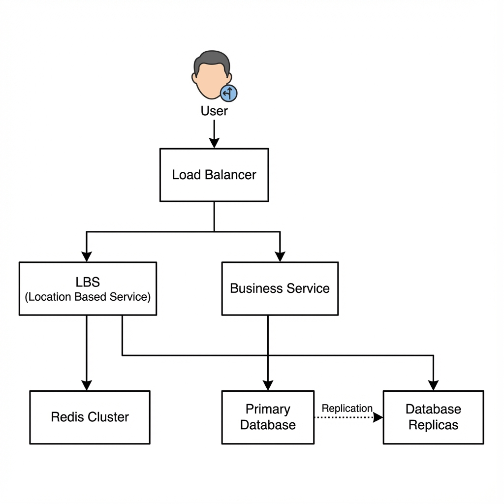
*Note: A Load Balancer distributes traffic to the LBS (for reads) and Business Service (for writes). Data flows to a Primary database and is replicated to Read Replicas.*

### 3. Core Algorithms (Geospatial Indexing)
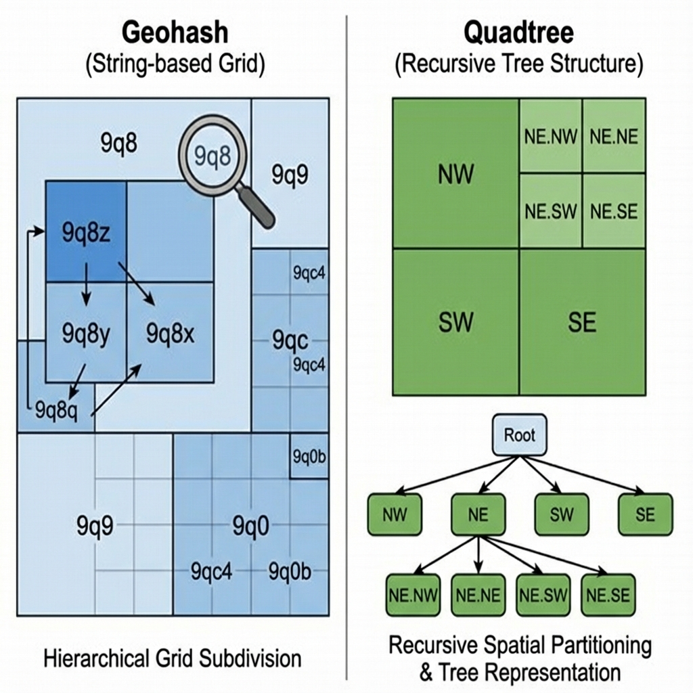
Standard SQL queries (`WHERE lat BETWEEN... AND long BETWEEN...`) are inefficient because they require scanning the whole table or intersecting two large datasets. The book explores spatial indexing:
*   **Geohash**: Recursively divides the world into smaller grids represented by base32 strings (e.g., `9q8zn`). Longer strings = smaller areas. Proximity search is done by matching prefixes.
    *   *Pros*: Easy to implement, fast.
    *   *Cons*: Boundary issues (close points can have different prefixes). Fixed grid logic.
*   **Quadtree**: A tree structure where each node partitions into 4 children. Leaf nodes store business IDs. Split logic relies on business density (e.g., split node if > 100 businesses).
    *   *Pros*: Adapts to population density (small grids in cities, large in rural areas).
    *   *Cons*: Harder to update and rebalance.
*   **Google S2**: Uses Hilbert curves to map 2D data to 1D. Used by Google Maps and Tinder.

### 4. Design Deep Dive
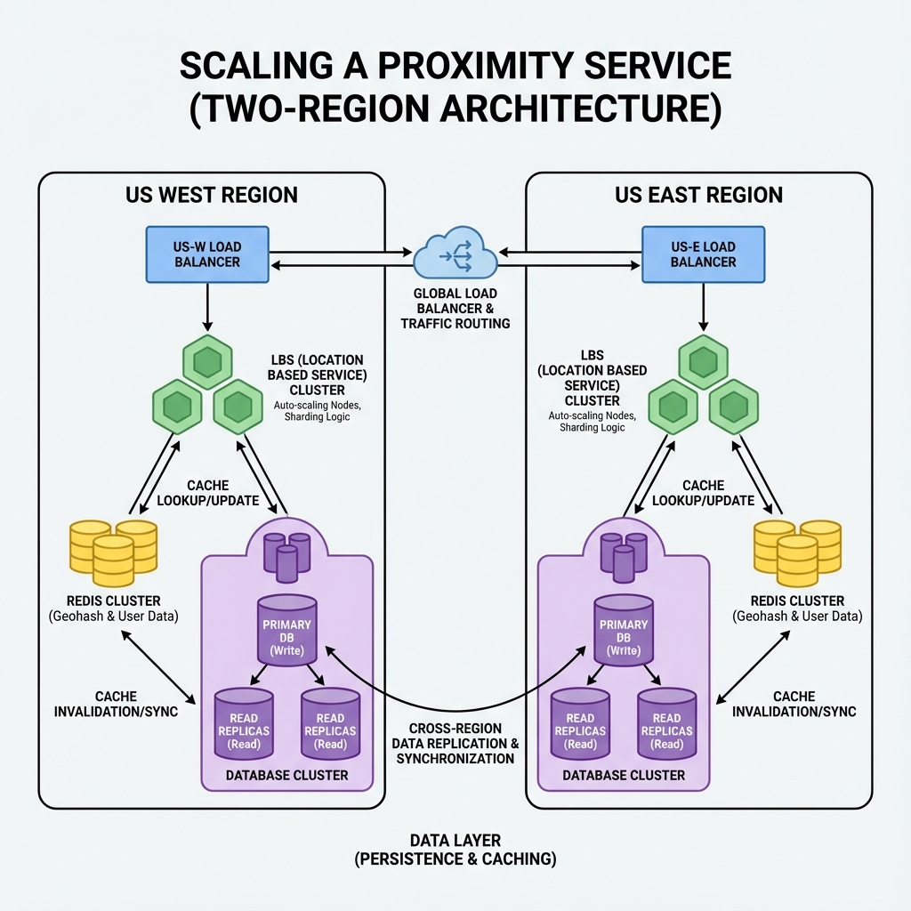
*   **Scaling Database**: The geospatial index is small enough (e.g., 1.71GB for Quadtree) to fit in memory, but read volume requires scaling.
    *   *Recommendation*: Use Read Replicas rather than complex sharding for the index.
*   **Caching**:
    *   **Geohash Cache**: Redis cluster creating keys for each geohash (at various precisions) mapped to a list of business IDs.
    *   **Business Info Cache**: Redis storing hydrated business objects.
*   **Replication**: Deploy LBS and Redis clusters across multiple regions (US West, Europe, etc.) to reduce latency and comply with data privacy (GDPR).

---

## Chapter 2: Nearby Friends

Design a scalable backend for a real-time location sharing feature (like Facebook's "Nearby Friends").

### 1. Requirements
*   **Functional**:
    *   Users view a list of friends within a 5-mile radius.
    *   List updates every few seconds.
*   **Scale**:
    *   100M DAU, 10% concurrent users (10M).
    *   Each user has ~400 friends.
    *   Location update every 30s = ~334k updates/sec.
    *   Fan-out: 334k * 400 friends * 10% active ~ 14 million updates/sec.

### 2. High-Level Design
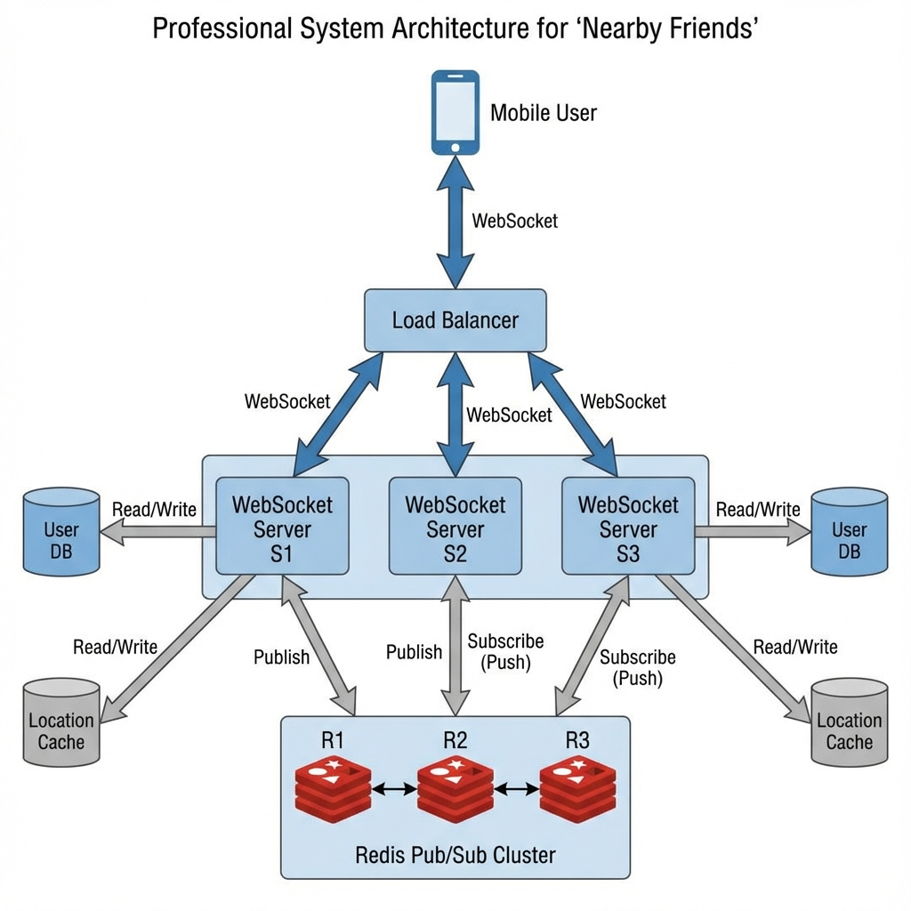
A Peer-to-Peer approach is unreliable for mobile. The solution uses a shared backend with persistent connections.
*   **Components**:
    *   **WebSocket Servers**: Maintain persistent bi-directional connections with clients. push new locations to friends.
    *   **Redis Pub/Sub**: Acts as the message routing layer.
    *   **Location Cache**: Stores the latest location (TTL enabled).
    *   **User DB**: Stores friendship data.

### 3. Deep Dive
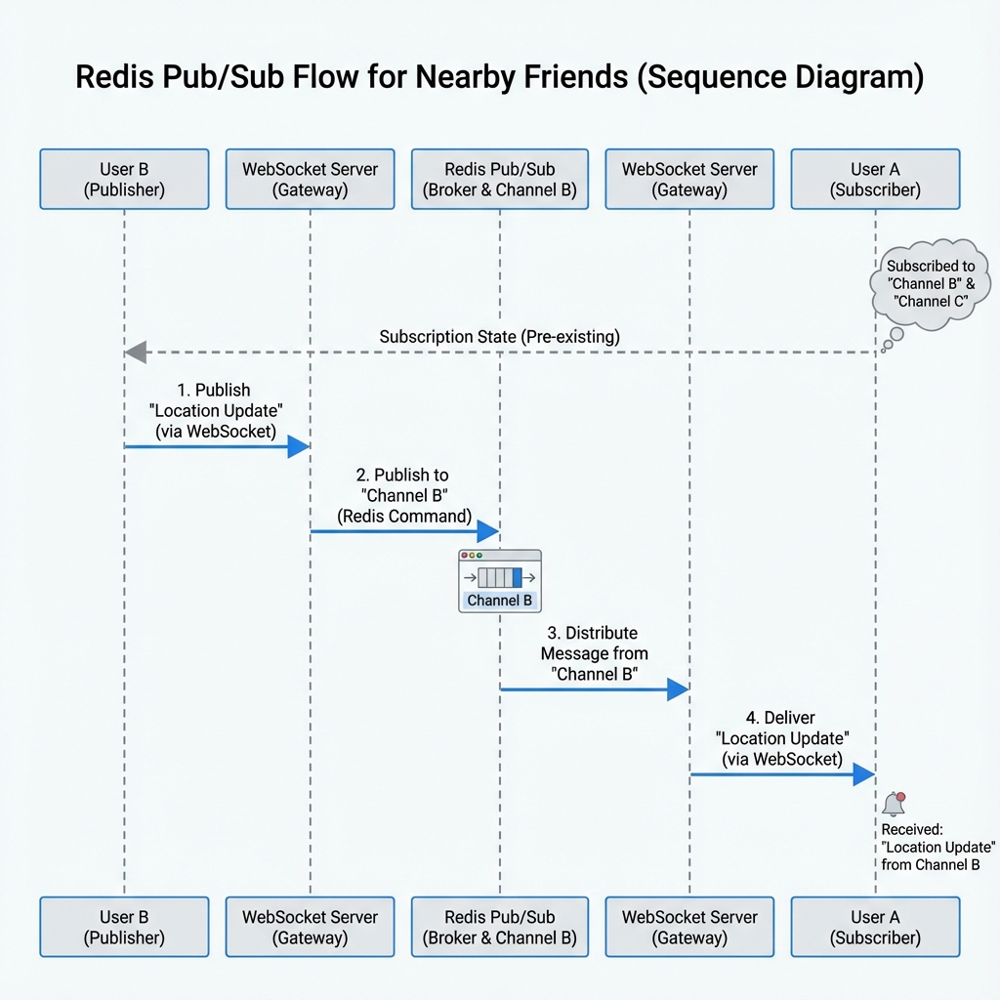
*   **Redis Pub/Sub Channel Architecture**:
    *   Assign a unique channel for **every** user.
    *   When User A comes online, they subscribe to the channels of all their friends (B, C, D).
    *   When User B moves, they publish to their own channel. Redis pushes this to subscribers (A).
    *   *WebSocket Server**: Receives the update for A, calculates distance; if < 5 miles, pushes to A's device.
*   **Scaling Pub/Sub**:
    *   Memory is cheap (200GB for 100M channels), but CPU is the bottleneck.
    *   **Distributed Cluster**: Use a Hash Ring (Service Discovery) to distribute channels across hundreds of Redis servers.
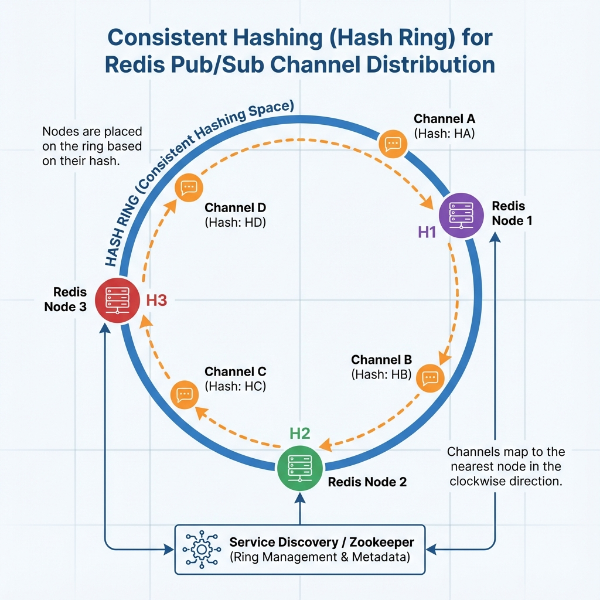
*   **Alternative: Erlang**:
    *   Mentioned as a superior fit due to lightweight processes (one process per user) and native message passing, potentially replacing the Redis layer.

**Table: Redis Pub/Sub vs Erlang**
| Feature | Redis Pub/Sub | Erlang |
| :--- | :--- | :--- |
| **Architecture** | External Service + Stateless Websocket | Monolithic Application (Cluster) |
| **Pros** | Leverages existing infrastructure knowledge | extremely efficient for concurrency |
| **Cons** | Higher CPU overhead for routing | Niche skill set |

---

## Chapter 3: Google Maps

Design a scalable map service supporting navigation and location sharing, similar to Google Maps.

### 1. Requirements
*   **Functional**:
    *   User Location Update (to track users and traffic).
    *   Navigation Service (ETA, shortest path).
    *   Map Rendering (Tiling).
*   **Scale**:
    *   1 Billion DAU.
    *   Historical data storage: ~50PB (Petabytes) for map tiles (before optimization).
    *   Write QPS: ~1 million location updates/sec (peak).

### 2. Core Concepts
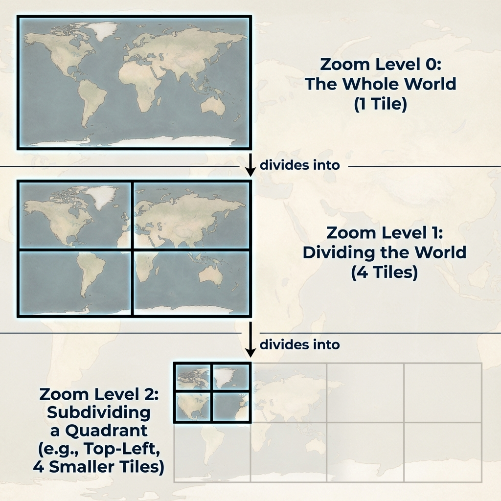
*   **Geocoding**: Converting addresses to (Latitude, Longitude).
*   **Tiling (Map Rendering)**:
    *   The world is divided into tiles at different zoom levels.
    *   **Zoom Level 0**: 1 tile (256x256 pixels) for the whole world.
    *   **Zoom Level 21**: ~4.4 trillion tiles.
    *   Tiles are **static images** served via CDN.
*   **Routing Tiles**:
    *   Differ from Map Tiles. They are binary files containing graph data (nodes=intersections, edges=roads) used for pathfinding algorithms.
    *   Stored in Object Storage (S3) and cached by the Navigation Service.

### 3. High-Level Design
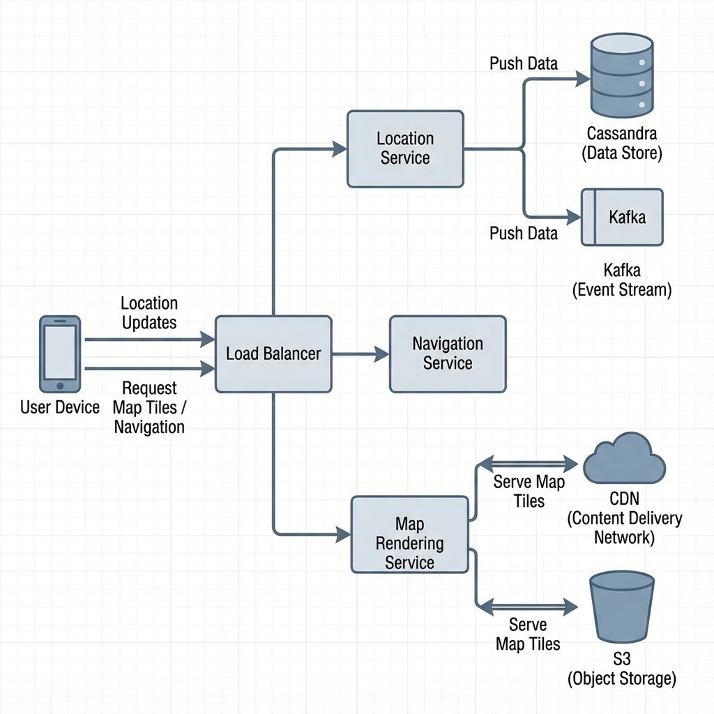
*   **Location Service**: Handles high-volume location updates.
    *   Uses **Cassandra** (optimized for write-heavy capability) to store current user locations.
    *   Pushes data to **Kafka** for stream processing (Live Traffic, Analytics).
*   **Navigation Service**:
    *   Shortest Path Service calculates routes using **A* or Dijkstra** on Routing Tiles.
    *   **ETA Service** uses Machine Learning on traffic history to predict time.
*   **Map Rendering**:
    *   Clients determine which tiles they need (based on viewport & zoom) and fetch from CDN.
    *   *Optimization*: Use **Vector Tiles** (paths/polygons) instead of Raster images to save bandwidth and improve zooming smoothness.

### 4. Deep Dive
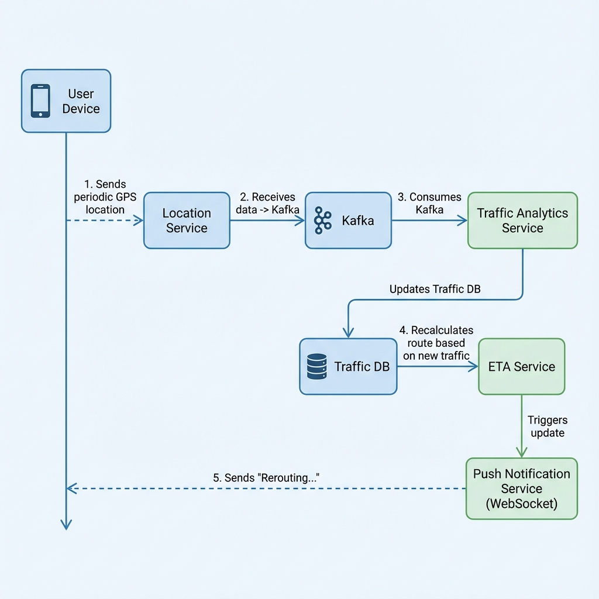
*   **Adaptive ETA & Rerouting**:
    *   *Challenge*: efficiently notifying affected users when traffic builds up.
    *   *Solution*: Store the user's active route as a set of recursive tiles. When a tile's traffic changes, quickly identify all users whose route contains that tile.
*   **Delivery Protocol**: Use **WebSocket** for bi-directional communication (server pushing reroute suggestions to client).

---

## Chapter 4: Distributed Message Queue

Design a distributed message queue (like Kafka, Pulsar) that supports long retention and repeated consumption.

### 1. Comparison
*   **Traditional MQ (RabbitMQ)**:
    *   Deletes messages after delivery.
    *   Order not guaranteed.
    *   Short retention (RAM-focused).
*   **Distributed MQ (Kafka)**:
    *   **Long Retention** (Disk-focused).
    *   **Repeated Consumption** (multiple consumers read same message).
    *   Strict ordering within partitions.

### 2. High-Level Architecture
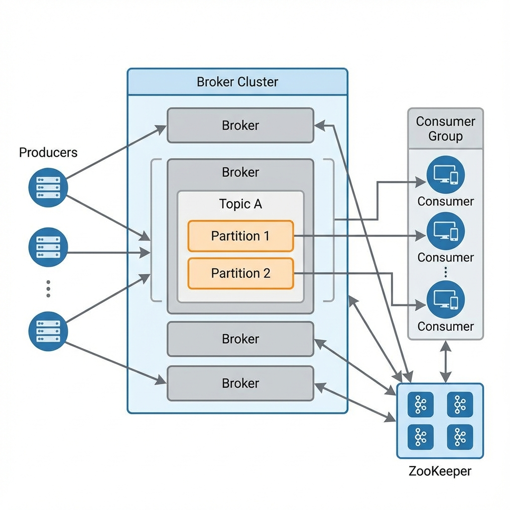
*   **Broker**: The server holding data.
*   **Topic**: Logical category of messages.
*   **Partition**: Sharding mechanism. A topic is split into partitions distributed across brokers.
*   **Consumer Group**:
    *   Achieves both **Point-to-Point** (put all consumers in one group -> load balancing) and **Pub/Sub** (put consumers in different groups -> broadcast) models.

### 3. Deep Dive
*   **Storage (WAL)**:
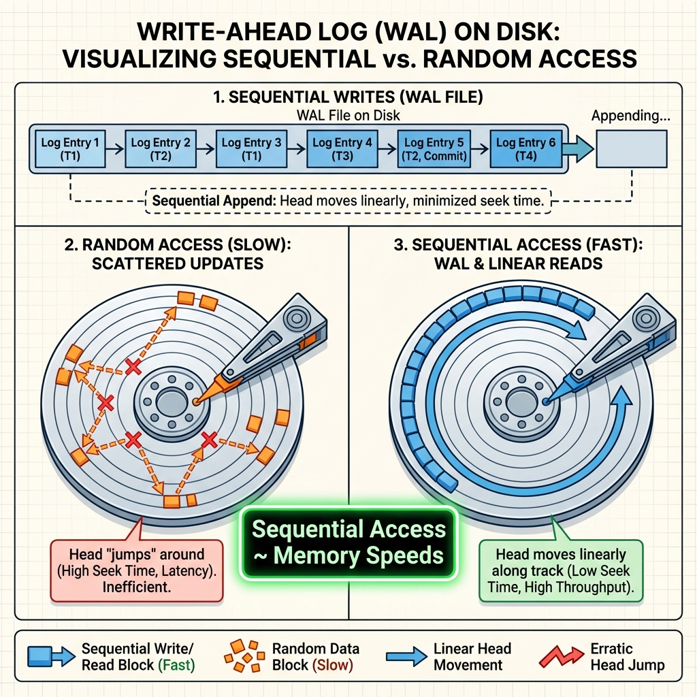
    *   Uses **Write-Ahead Log** on disk. Sequential writes are extremely fast on HDD/SSD (comparable to memory).
    *   Relies on OS **Page Cache** rather than application-level caching.
*   **Data Structure**: Fixed schema (Key, Value, Topic, Partition, Offset) to avoid serialization overhead.
*   **Batching**: Producers send batches, Brokers writes batches, Consumers read batches. Critical for throughput.
*   **Replication**:
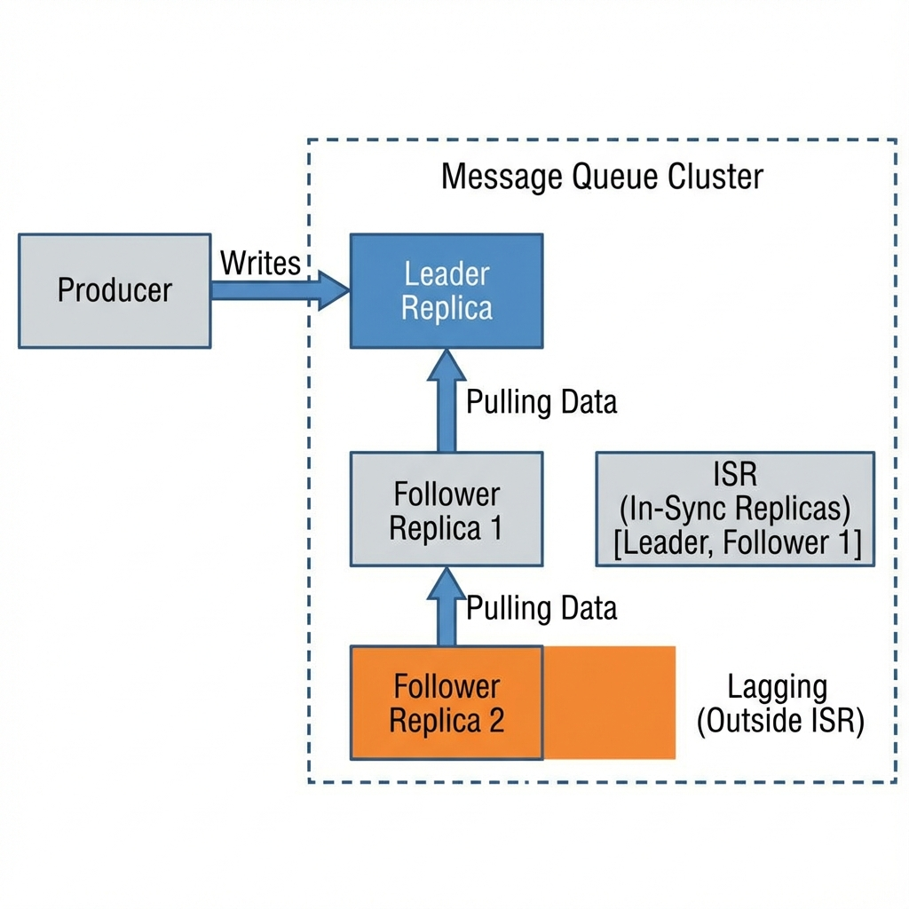
    *   **Leader-Follower** model.
    *   **ISR (In-Sync Replicas)**: Replicas that catch up to leader. Only ISRs are eligible for election.
    *   **ACK Settings**:
        *   `ACK=0`: Fire & forget (Fastest, data loss risk).
        *   `ACK=1`: Leader persisted (Balanced).
        *   `ACK=all`: All ISRs persisted (Slowest, most durable).
*   **Scalability**:
    *   Adding Broker: Controller redistributes replicas.
    *   Adding Partition: Easy scaling.
    *   Removing Partition: Hard, relies on data retention expiry.

---

## Chapter 5: Metrics Monitoring and Alerting System

Design a scalable system for monitoring infrastructure metrics (CPU, Memory, Request Count), similar to Datadog, Prometheus, or Grafana.

### 1. Requirements
*   **Scale**:
    *   100M Daily Active Users (DAU).
    *   1,000 server pools, each with 100 machines (100k servers total).
    *   ~10 million metrics written per day.
    *   Retention: 1 year.
*   **Data Model**:
    *   Time-series data: `Metric Name`, `Tags/Labels`, `Timestamp`, `Value`.
    *   Access Pattern: Write-heavy (constant stream), Read-spiky (dashboards/alerts).

### 2. High-Level Design

*   **Metrics Collector**: Gather metrics from sources.
*   **Kafka**: Used as a buffer to handle high throughput and decouple ingestion from storage.
*   **Time-Series Database (TSDB)**: Optimized for handling time-based data arrays.
*   **Query Service**: Handles visualization requests.
*   **Alerting System**: Checks against rules and sends notifications.

### 3. Core Concepts
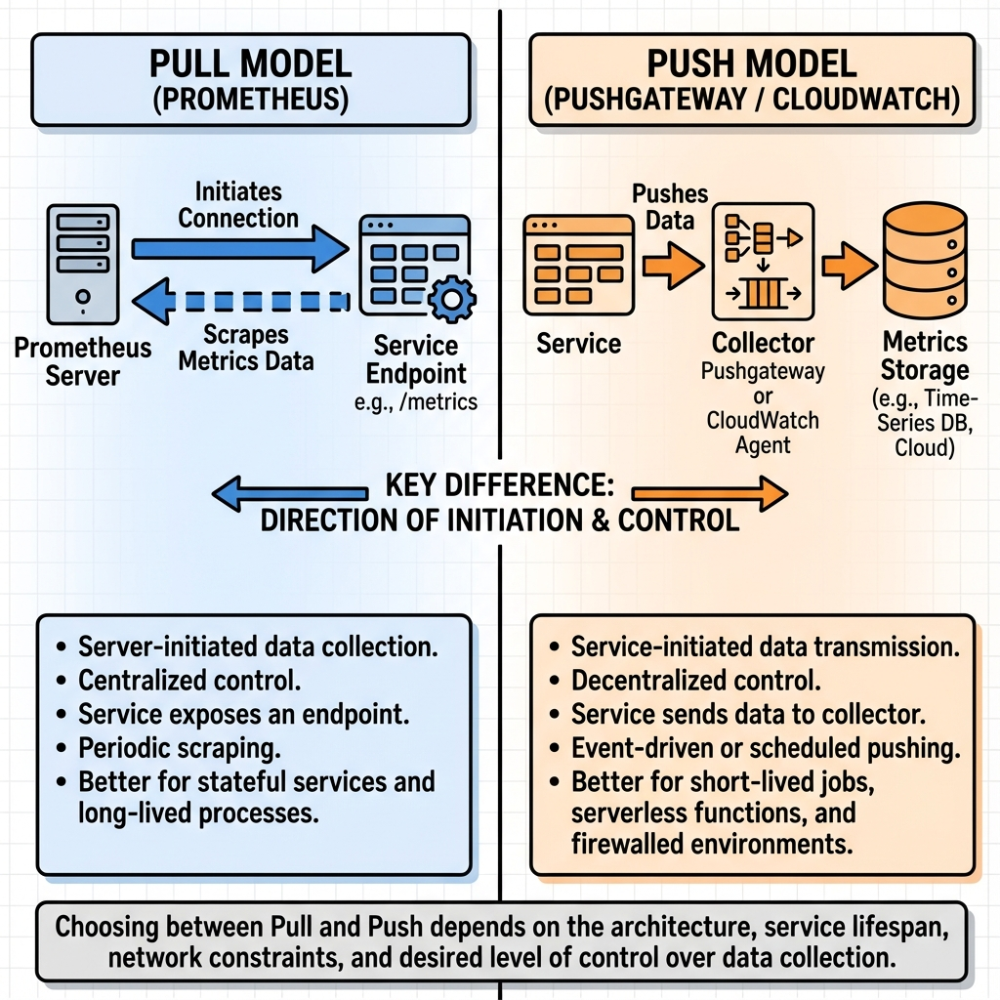
*   **Pull vs Push Model**:
    *   **Pull (Prometheus)**: Collector "pulls" metrics from service endpoints.
        *   *Pros*: Easier debugging (can curl endpoint), authenticity (only configured targets).
        *   *Cons*: Network complexity in multi-DC.
    *   **Push (Amazon CloudWatch, Graphite)**: Services "push" metrics to collector.
        *   *Pros*: Better for short-lived jobs (serverless), easy to scale with load balancer.
*   **Storage Optimization**:
    *   RDBMS is poor for this use case (inefficient for rolling averages).
    *   **TSDB** (like InfluxDB) is chosen.
    *   **Downsampling**: Strategy to reduce storage cost.
        *   raw data (7 days)
        *   1-minute resolution (30 days)
        *   1-hour resolution (1 year).

### 4. Design Deep Dive
*   **Alerting System**:
    *   **Rule Config**: Stored in YAML files, loaded into cache.
    *   **Alert Manager**: Periodically queries TSDB to check thresholds.
    *   **Desensitization**: Merging duplicate alerts (e.g., "CPU high" from same host multiple times) before sending to PagerDuty/Email.
*   **Visualization**: Build vs Buy. Recommendation is **Grafana** (Buy/Open Source) rather than building a custom dashboard, as it integrates natively with most TSDBs.

---

## Chapter 6: Ad Click Event Aggregation

Design a system to track and aggregate ad clicks for real-time bidding (RTB) feedback and billing.

### 1. Requirements
*   **Scale**:
    *   1 Billion ad clicks per day.
    *   2 Million active ads.
    *   Peak QPS: ~50k.
*   **Goals**:
    *   Aggregate clicks per ad in the last M minutes.
    *   Return Top 100 most clicked ads in the last M minutes.
    *   **Accuracy**: Critical for billing (money is involved).
    *   **Latency**: Minutes acceptable for billing; RTB feedback needs sub-second (though this design focuses on the aggregation pipeline).

### 2. High-Level Design
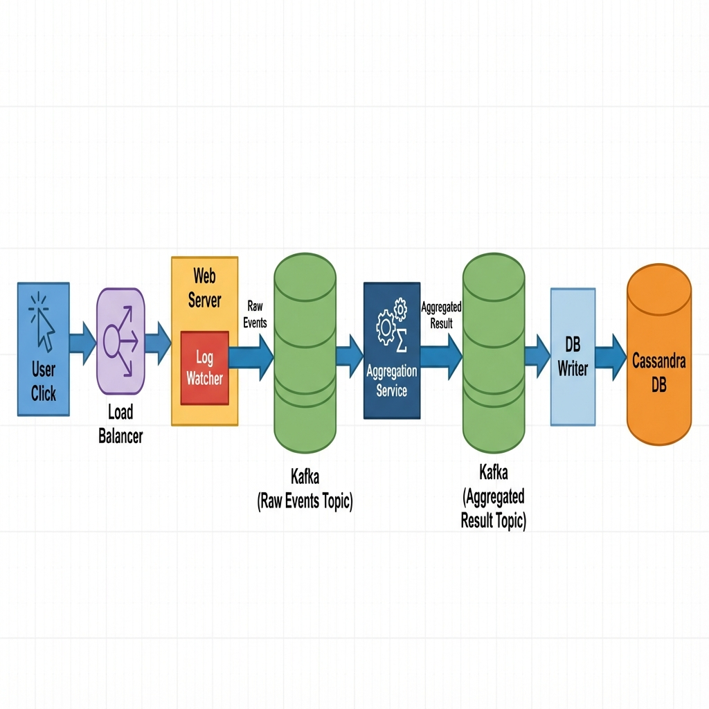
The system follows a typical Big Data streaming architecture:
*   **Log Watcher**: Agents on servers forwarding logs to Kafka.
*   **Aggregation Service**: Consumes from Kafka, performs MapReduce-style aggregation in memory, and outputs to a second Kafka topic.
*   **DB Writer**: Consumes the aggregated results and writes to the DB.
*   **Database**: Cassandra (optimized for write-heavy capability).

### 3. Core Concepts
*   **Stream Processing (Kappa Architecture)**:
    *   Uses a single stream processing path for both real-time and historical replay (simplifies code maintenance compared to Lambda architecture).
*   **Time**:
    *   **Event Time**: When the click happened (Client side). critical for accuracy.
    *   **Processing Time**: When the server received it.
    *   **Watermark**: A mechanism to handle late-arriving events (e.g., wait 15s extra before closing the window).
*   **Aggregation Windows**:
    *   **Tumbling Window**: Fixed, non-overlapping (e.g., every 1 min). Used for Billing counts.
    *   **Sliding Window**: Overlapping (e.g., last 1 min, updated every 10s). Used for "Top N" lists.

### 4. Design Deep Dive
*   **Fault Tolerance**:
    *   Since aggregation happens in memory, a node crash loses data.
    *   **Solution**: Regular snapshots of the system state (Map/Reduce state + Offsets) to remote storage (HDFS/S3). Recovery involves loading the snapshot and replaying Kafka events from the stored offset.
*   **Data Integrity (Reconciliation)**:
    *   End-of-day batch job that sorts raw data and compares totals with the real-time aggregated results to ensure billing accuracy.
*   **Exactly-Once Delivery**:
    *   Uses **Atomic Commits** (saving the Kafka offset AND the aggregation result in the same transaction) or Idempotency keys.

---

## Chapter 7: Hotel Reservation System

Design a booking system for a hotel chain (e.g., Marriott) with 5,000 hotels and 1M rooms.

### 1. Requirements
*   **Functional**: View hotels/rooms, Reserve a room, Admin panel. Overbooking (10%) allowed.
*   **Scale**:
    *   Traffic is "Read-heavy" (browsing) but "Write-low" (Reserving ~3 TPS).
    *   Data consistency (ACID) is critical to prevent double booking.

### 2. High-Level Design
*   **Microservice Architecture**:
    *   **Hotel Service**: Static data (descriptions, photos). heavily cached (CDN/Redis).
    *   **Rate Service**: Calculates dynamic pricing.
    *   **Reservation Service**: Handles booking logic and inventory.
*   **Data Model**:
    *   **Relational Database (SQL)** is chosen for ACID properties.
    *   **Inventory Table**: `room_type_inventory` (hotel_id, room_type_id, date, total_inventory, total_reserved). One row per date per room type.
    *   **Reservation Table**: `reservation` (reservation_id, hotel_id, room_type_id, date_range, status).

### 3. Design Deep Dive
*   **Concurrency (Double Booking)**:
    *   **Scenario 1: Same user double clicks**: Solved by Client-side button disable + Idempotency Key (`reservation_id`).
    *   **Scenario 2: Multiple users race for last room**:
        *   *Pessimistic Locking* (`SELECT FOR UPDATE`): Too slow.
        *   *Optimistic Locking* (`version` column): Best choice for low contention.
        *   *Database Constraints* (`CHECK inventory >= 0`): Simple but hard to maintain.
*   **Scalability**:
    *   **Sharding**: Shard by `hotel_id`.
    *   **Caching**: Redis stores inventory.
        *   *Issue*: Data inconsistency (Cache says available, DB says full).
        *   *Fix*: Trust DB as source of truth. If DB rejects, return error to user.
*   **Microservices Data Consistency**:
    *   The book recommends a **Pragmatic/Hybrid approach**: Store Inventory and Reservation tables in the **same database** to use local ACID transactions, rather than implementing complex distributed transactions (2PC/Saga).

---

## Chapter 8: Distributed Email Service

Design a scalable email system like Gmail or Outlook.

### 1. Requirements
*   **Scale**:
    *   1 Billion Users.
    *   **Storage Heavy**: ~730 PB/year for metadata, 1.5 EB (Exabytes) for attachments.
    *   **High QPS**: 100k outgoing emails/sec.
*   **Protocols**:
    *   **SMTP**: Sending emails between servers.
    *   **POP/IMAP**: Fetching emails (Legacy).
    *   **HTTP/REST**: Modern webmail/mobile interaction.

### 2. High-Level Design
*   **Outgoing Flow**: Web Sender -> Load Balancer -> Web Server -> **Outgoing Queue** -> SMTP Workers -> External Mail Servers.
*   **Incoming Flow**: External SMTP -> Load Balancer -> **Incoming Queue** -> Processing Workers (Spam/Virus check) -> Storage & Cache -> Real-time Push (WebSocket) to Receiver.
*   **Components**:
    *   **Real-time Servers**: Stateful WebSocket servers for pushing new mail notifications.
    *   **Metadata DB**: Stores headers, status (read/unread), folders.
    *   **Attachment Store**: Object Storage (S3).
    *   **Search Engine**: Elasticsearch or Custom.

### 3. Core Concepts
*   **Storage Strategy**:
    *   **Attachments**: S3 (No-brainer).
    *   **Metadata**: Relational DBs fail at this scale (indexes are too big).
    *   **Choice**: **NoSQL** (Bigtable/Cassandra) or Custom Distributed DB.
    *   **Partitioning**: By `user_id` (All emails for a user on same shard).
*   **Data Model (NoSQL)**:
    *   `emails_by_folder`: PK=`user_id`, Clustering=`folder_id` + `email_id` (TimeUUID).
    *   **Denormalization**: Separate tables for `read_emails` and `unread_emails` to support fast filtering without complex indexes.

### 4. Design Deep Dive
*   **Search**:
    *   **Option 1: Elasticsearch**: Easy to implement, but double storage/maintenance.
    *   **Option 2: Native Custom Search** (LSM Tree): Optimized for write-heavy index updates (since every incoming email triggers an index write). LSM Trees (Log-Structured Merge) allow sequential disk writes, avoiding random I/O bottlenecks.
*   **Deliverability**:
    *   **IP Warming**: Gradually increase traffic on new IPs to avoid spam filters.
    *   **Reputation Management**: Separate IPs for Marketing vs Transactional mail.
    *   **Feedback Loops**: Process SNS notifications for Hard Bounces and Complaints.
*   **Consistency vs Availability**:
    *   Email requires strict consistency (User A deletes mail, User A must not see it on refresh).
    *   Trade-off: Prioritize **Consistency** over Availability. If a shard replica is down, prevent access rather than showing stale data.

---

## Chapter 9: S3-like Object Storage

Design a distributed object storage system similar to Amazon S3.

### 1. Requirements
*   **Scale**: 100 PB data, 100 Trillion objects. High durability (6 nines), High availability (4 nines).
*   **Features**: Upload, Download, Versioning, Listing.
*   **Constraint**: Simple API (PUT/GET), Immutable objects (Write Once, Read Many).

### 2. High-Level Design
*   **Architecture Components**:
    *   **Load Balancer**: Distributes REST requests.
    *   **API Service**: Stateless orchestrator, handles IAM (Auth).
    *   **Metadata Store**: Database holding object info (`bucket_id`, `object_id`, `metadata`).
    *   **Data Store**: Distributed system holding actual file bytes.
*   **Data Store Internals**:
    *   **Placement Service**: Maintains a **Virtual Cluster Map** (topology of nodes/racks). Decides where chunks go (Replication).
    *   **Data Node**: Stores data.

### 3. Core Concepts
*   **Storage Hierarchy**:
    *   **File Storage** (Hierarchical /folders): Good for general use.
    *   **Block Storage** (Raw volume): High performance (DBs/VMs).
    *   **Object Storage** (Flat /buckets): Best for massive scale unstructured data.
*   **Small Object Problem**:
    *   Filesystems (Ext4/XFS) handle millions of 1KB files poorly (wasted block space, inode exhaustion).
    *   **Solution**: Aggregate many small objects into a larger **Read-Write file** (conceptually like a Write-Ahead Log). When it reaches a size limit (e.g., a few GB), mark as **Read-Only**.
    *   **Lookup**: A local DB (SQLite) on each data node maps `object_id` -> `(file_path, offset, size)`.

### 4. Design Deep Dive
*   **Durability**:
    *   **Replication**: (Primary + 2 secondaries). Simple, high durability (6 nines), but 200% storage overhead.
    *   **Erasure Coding**: (4+2 chunks). Breaks data into 4 parts + 2 parity. Survives 2 node failures with only 50% overhead. Better for cold storage.
*   **Listing Objects**:
    *   S3 "Folders" are just prefixes.
    *   To list objects efficiently, the metadata DB (sharded by hash of bucket_name) might need a separate localized index for listing if pagination is complex across shards.
*   **Garbage Collection**:
    *   Deleted objects or orphaned multipart uploads aren't removed immediately.
    *   **Compaction**: A background process merges valid objects from old Read-Only files into new files and deletes the old ones (reclaiming space).
*   **Multipart Upload**: Break large files (>GB) into chunks, upload in parallel, reassemble on server.

---

## Chapter 10: Real-time Gaming Leaderboard

Design a real-time leaderboard for an online mobile game.

### 1. Requirements
*   **Scale**: 5M DAU, 25M MAU.
*   **Write Load**: 10 matches/user/day = 50M updates/day (~500 TPS average, 2500 TPS peak).
*   **Features**:
    *   Display Top 10 Global Users.
    *   Display User's Rank.
    *   Real-time updates.

### 2. High-Level Design
*   **The Problem with SQL**: `ORDER BY score DESC LIMIT 10` is agonizingly slow with millions of rows (Full Table Scan or expensive B+Tree updates). Not suitable for real-time.
*   **Solution**: **Redis Sorted Sets (ZSET)**.
    *   In-memory, extremely fast (O(log n)).
    *   Built-in ranking and range queries.

### 3. Core Concepts (Redis)
*   **ZSET**: Sorts elements by score. Unique members.
    *   `ZADD leaderboards:feb:2024 <score> <user_id>`: Insert/Update score.
    *   `ZINCRBY leaderboards:feb:2024 <increment> <user_id>`: Add points to existing score.
    *   `ZREVRANGE leaderboards:feb:2024 0 9 WITHSCORES`: Get Top 10.
    *   `ZREVRANK leaderboards:feb:2024 <user_id>`: Get exact rank of a user.

### 4. Design Deep Dive
*   **Scaling Redis**:
    *   **Memory**: 25M users * 26 bytes ~ 650MB. Fits easily in a single node.
    *   **QPS**: 2.5k TPS is easy for single Redis (handles 100k+).
    *   **If Scale x100 (500M DAU)**:
        *   **Option A: Hash Partitioning** (by `user_id`).
            *   Even distribution.
            *   **Problem**: Getting Top 10 requires **Scatter-Gather** (query all shards, merge & sort results). Slow.
        *   **Option B: Fixed Partitioning** (by Score Range).
            *   Shard 1: 1-1000, Shard 2: 1001-2000, etc.
            *   **Pros**: Top 10 is fast (just query the highest partition).
            *   **Cons**: Uneven distribution (most players have low scores). Hard to determine "Global Rank" for a user (must count all users in higher partitions).
*   **NoSQL Alternative**:
    *   DynamoDB with Global Secondary Indexes.
    *   **Partitioning Key**: Cannot use "Month" (e.g., `game_name#month`) as PK because it creates a **Hot Partition** (all writes go to one node). Must shard (e.g., `game_name#month#shard_id`).
*   **Cloud Native**:
    *   Serverless: AWS API Gateway + Lambda + Redis.

---

## Chapter 11: Payment System

Design a backend for an e-commerce payment system (like Amazon/Stripe).

### 1. Requirements
*   **Scale**: 1 Million transactions/day (10 TPS). THROUGHPUT IS NOT THE PROBLEM.
*   **Priorities**: **Reliability**, **Data Consistency** and **Compliance** (PCI DSS) are critical. No data loss allowed.
*   **Flows**:
    *   **Pay-in**: Buyer pays E-commerce site.
    *   **Pay-out**: E-commerce site pays Seller.

### 2. High-Level Design
*   **Components**:
    *   **Payment Service**: Orchestrates the payment flow.
    *   **Payment Executor**: Sends orders to PSP (Stripe/PayPal).
    *   **Ledger**: Records all financial transactions (Double Entry).
    *   **Wallet**: Tracks merchant account balances.
    *   **PSP (Payment Service Provider)**: External system moving actual money (e.g., Stripe, PayPal).

### 3. Core Concepts
*   **Double-Entry Ledger Accounting**:
    *   Fundamental for financial systems. Sum of all entries must be 0.
    *   Example: Buyer pays \$1.
        *   Debit: Buyer Account (\$1)
        *   Credit: Merchant Account (\$1)
    *   Provides end-to-end traceability and consistency.
*   **Hosted Payment Page**:
    *   To avoid PCI DSS compliance complexity (handling raw credit card numbers), use a widget/iframe provided by the PSP.
    *   The PSP handles the sensitve data and returns a token.

### 4. Design Deep Dive
*   **Reconciliation**:
    *   The most critical defense against inconsistency.
    *   Periodically compare internal **Ledger** vs. external **PSP Settlement Files** (e.g., nightly batch job).
    *   Detects mismatched money caused by network failures or timeouts.
*   **Handling Failures**:
    *   **Retry with Exponential Backoff**: For transient network errors.
    *   **Idempotency**: Crucial for "Exactly-Once" processing.
        *   Use `payment_order_id` as the Idempotency Key (nonce) when calling PSP.
        *   If the same request is sent twice (e.g., user clicks "Pay" twice), PSP returns the cached result for the first one.
*   **Data Types**:
    *   **NEVER** use `double`/`float` for money (rounding errors). Use `String` or `BigDecimal` (Long integer for cents).

---

## Chapter 12: Digital Wallet

Design a backend for a digital wallet (like PayPal/Venmo) supporting balance transfers between users.

### 1. Requirements
*   **Scale**: 1 Million TPS (Transactions Per Second).
*   **Reliability**: 99.999%.
*   **Correctness**: Transational (ACID) and **Reproducible** (Audit-proof).

### 2. High-Level Design Evolution
*   **Approach 1: In-Memory (Redis)**:
    *   Sharding Redis by UserID.
    *   *Problem*: Redis is not durable enough for banking. A node crash losing 1 second of data is unacceptable.
*   **Approach 2: Distributed Transactions (RDBMS)**:
    *   2-Phase Commit (2PC) or Saga.
    *   *Problem*: Performance bottleneck (locks), complex to audit "why" a balance changed.
*   **Approach 3: Event Sourcing (The Chosen One)**:
    *   Instead of storing just the *State* (Balance=$50), store the *Events* (Deposit $50, Transfer $10).
    *   **State Machine**: Deterministic function that reads events and produces state.
    *   **Advantages**:
        *   **Auditability**: Can replay events to any point in time.
        *   **Debugging**: Can re-run logic on historical events to fix bugs.

### 3. Design Deep Dive (High Performance)
To achieve 1M TPS with reliability:
*   **mmap (Memory Mapped Files)**:
    *   Writing to a remote DB (network) is too slow.
    *   Solution: Appends events to a file on local disk using `mmap`. The OS handles caching. It's as fast as writing to memory but persistent.
    *   *Note*: This relies on "Single Writer Principle" (like LMAX Disruptor).
*   **Consensus (Raft)**:
    *   To prevent data loss if the single node dies, use **Raft** to replicate the Event Log to follower nodes.
*   **CQRS (Command Query Responsibility Segregation)**:
    *   **Write Path**: Highly optimized, append-only Event Log.
    *   **Read Path**: Separate Read-Only state machines (or Views) consume events and update a Read Database (e.g., for user balance queries).

---

## Chapter 13: Stock Exchange

Design a modern stock exchange matching engine (like NYSE/Nasdaq/LMAX).

### 1. Requirements
*   **Latency**: Extremely low (tens of microseconds).
*   **Throughput**: Billions of orders/day.
*   **Fairness**: First-Come-First-Serve is mandatory.
*   **Data**: High-volume market data broadcasting.

### 2. High-Level Architecture
*   **Client Gateway**: Auth, Rate Limiting.
*   **Order Manager**: Risk checks (e.g., "Max $1M/day"), Wallet checks.
*   **Sequencer**:  **The Heart of the System**. Stamps every incoming transaction with a monotonically satisfying sequence ID.
*   **Matching Engine**: Matches Buy/Sell orders (Limit Orders) using an Order Book.
*   **Market Data Publisher**: Broadcasts results (Candlesticks/Order Book) to subscribers.

### 3. Design Deep Dive (Ultra-Low Latency)
Network hops and Disk I/O are the enemies.
*   **Single Server / Colocation Architecture**:
    *   Standard Microservices (HTTP/GRPC across servers) are too slow (ms latency).
    *   **Solution**: Run critical components (Order Manager, Sequencer, Matcher) on **One Server** (or same rack) communicating via **Shared Memory (mmap)** ring buffers.
    *   Eliminates network serialization/deserialization cost.
*   **Application Loop (CPU Pinning)**:
    *   Pin the main thread to a specific CPU Core.
    *   **No Context Switches**: The OS Scheduler doesn't interrupt the thread.
    *   **No Locks**: Single-threaded logic avoids expensive locking.
*   **Determinism**:
    *   Because of the **Sequencer**, if the primary crashes, a secondary can replay the same sequence of events and reach the *exact same state*.
    *   Allows High Availability (Active-Passive) without complex state synchronization.
*   **Fairness (Multicast)**:
    *   Use **UDP Multicast** to broadcast market data so all traders receive it physically at the same time (network switch replicates packet).

---

## Glossary
*   **Wal**: Write-Ahead Log.
*   **Quadtree**: Geospatial index using recursive quadrants.
*   **Geohash**: String-based geospatial index.
*   **Idempotency Key**: A unique token sent with a request to ensure safe retries.
*   **Consensus (Raft)**: Algorithm for distributed nodes to agree on a value (log).
*   **LSM Tree**: Log-Structured Merge Tree. Write-optimized DB structure (Cassandra/RocksDB).
*   **Bloom Filter**: Probabilistic structure to quickly check if an element is *not* in a set.
*   **Gossip Protocol**: P2P communication for cluster state/heartbeats.
*   **CQRS**: Separating Read and Write models.
*   **Saga**: Distributed transaction pattern.
*   **Event Sourcing**: Storing state as a sequence of events.

---

## References
*   Xu, Alex & Lam, Sahn. *System Design Interview - An Insider's Guide (Volume 2)*. ByteByteGo, 2022.
*   Google Maps, Kafka, Redis, Cassandra, Amazon S3, Prometheus, Grafana, LMAX Disruptor.

